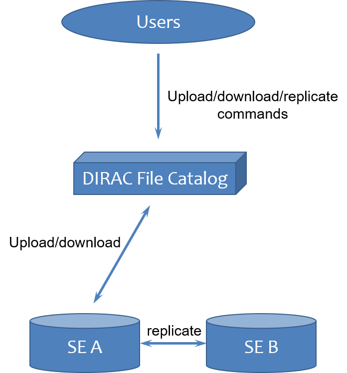
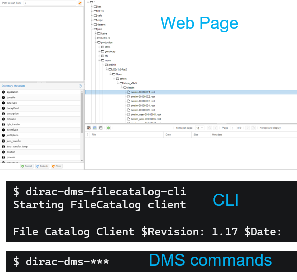
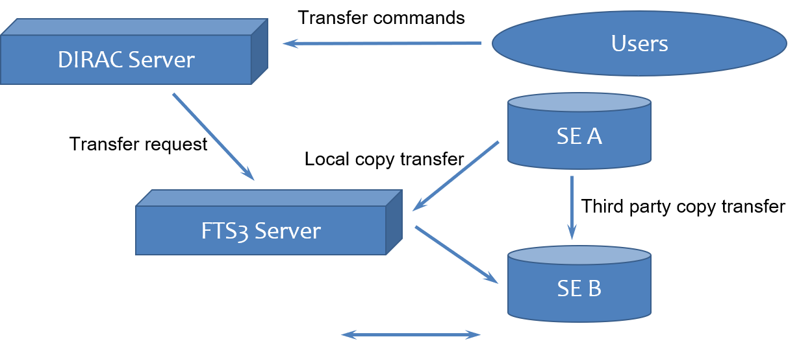
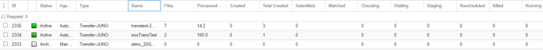

# Data usage
## Introduction
### Data Management Concepts
**Storage Element(SE):**
Distributed data storage site which can store users’ data or data produced by jobs.
In JUNO DIRAC, we have 4 data centers which provide 8 SEs.

| CHINA | Russia | Italy | France |
| -- | -- | -- | -- |
| IHEP-STORM | JINR-EOS | CNAF-STORM | IN2P3-DCACHE |
| IHEP-JUNOEOS | JINR-JUNO | CNAF-XROOTD* | IN2P3-XROOTD* |

> Notice: SEs with * is still in test.

**Replicas:**
One file copy in a specified SE.

**Replicate:**
Copy files from SE A to SE B. Will create a new replicas in SE B, so files will have 2 replicas: one in SE A, one in SE B.

**Logic File Name (LFN):**
File name in DIRAC File Catalog, recorded in DIRAC world.
Example: `/juno/user/z/zhangxt/tutor/`

**Physical File Name (PFN):**
File name actually exists in SE, usually is a protocol URL. Can be accessed by Grid tools.
Please refer to more details in backup slides.

### Data Management Framework
DIRAC File Catalog is a middle layer between user and SEs:
* Help user transfer and copy data;
* Manage data in DIRAC world.


## For Normal Users 
### Introduction
DIRAC File Catalog (DFC) is a DIRAC component which works as the file catalog system. It provide a **directory-based file catalog system** in DIRAC world.

Data access interfaces:
1. **Web page** – to browse file catalog
2. **Command Line Interface (CLI)** – interface to do data management **(recommended!)**
3. **Data management system (DMS) commands** – do data management in login nodes **(recommended!)**


> Note: CLI and DMS commands have functionally overlap, but aren’t totally same. Please choose the proper commands in different situations.

### Command Line Interface (CLI)
#### Introduction
DFC Command Line Interface (DFC-CLI) is used to perform all data management operations. 
#### Start and help
Start the CLI with the command:
```bash
$ dirac-dms-filecatalog-cli
Starting FileCatalog client

File Catalog Client $Revision: 1.17 $Date:

FC:/>
```
Call for help:
```bash
FC:/> help

Available commands:

EOF : Handler for EOF ( Ctrl D ) signal - perform quit

add : Upload a new file to a SE and register in the File Catalog

cd : Change directory to <path>

...
```
#### Basic DFC operations
Listing/changing/creating directory and changing ownership and permission, similar to Linux file system:
Change directory:
```bash
# usage: cd <path>
       : cd -
FC:/>cd /juno/user/z/zhangxt/
```
Create directory:
```bash
# usage: mkdir <path>
FC:/juno/user/z/zhangxt>mkdir tutor
Successfully created directory: /juno/user/z/zhangxt/tutor
```
List directory:
```bash
# usage: ls [-ltrnSh] <path>
FC:/juno/user/z/zhangxt>ls –l cc422
-rwxr-xr-x 1 xzhang juno_user 67 2021-04-22 08:20:46 cc422
```
Change ownership and permission:
```bash
# usage: chmod [-R] <mode> <path>
FC:/>chmod 600 cc422

# usage: chown [-R] <owner> <path>
FC:/>chown zhangxm cc422

FC:/juno/user/z/zhangxt>ls –l cc422
-rw------- 0 zhangxm juno_user 67 2021-07-07 09:19:34 cc422
```
> Notice: chown is different from Linux chown command
#### File copy
Upload file:
```bash
# usage: add <lfn> <local_file> <SE> [<guid>]
FC:/juno/user/z/zhangxt/tutor>add tutorupload /etc/hostname IHEP-STORM
File /juno/user/z/zhangxt/tutor/tutorupload successfully uploaded to the IHEP-STORM SE
```
Download file:
```bash
# usage: get <lfn> [<local_directory>]
FC:/juno/user/z/zhangxt/tutor>get tutorupload
File /juno/user/z/zhangxt/tutor/tutorupload successfully downloaded
```
Show file replicas:
```bash
# usage: replicas <lfn>
FC:/juno/user/z/zhangxt/tutor>replicas tutorupload
lfn: /juno/user/z/zhangxt/tutor/tutorupload
IHEP-STORM      srm://storm.ihep.ac.cn:8444/srm/managerv2?SFN=//juno/user/z/zhangxt/tutor/tutorupload
```
Replicate file:
```bash
# usage: replicate <LFN> <SE> [<SourceSE>]
FC:/juno/user/z/zhangxt/tutor>replicate tutorupload CNAF-STORM
{'Failed': {},
 'Successful': {'/juno/user/z/zhangxt/tutor/tutorupload': {'register': 0.05047893524169922,
                                                           'replicate': 11.522407054901123}}}
File /juno/user/z/zhangxt/tutor/tutorupload successfully replicated to the CNAF-STORM SE

FC:/juno/user/z/zhangxt/tutor>replicas tutorupload
lfn: /juno/user/z/zhangxt/tutor/tutorupload
CNAF-STORM      srm://storm-fe-ams.cr.cnaf.infn.it:8444/srm/managerv2?SFN=/juno/storm/dirac/juno/user/z/zhangxt/tutor/tutorupload
IHEP-STORM      srm://storm.ihep.ac.cn:8444/srm/managerv2?SFN=//juno/user/z/zhangxt/tutor/tutorupload
```
#### Removal
> **Warning: those 2 commands cannot remove files in SEs. If you want to remove files in SEs, use “dirac-dms-remove” series commands!**

Remove replicas:
```bash
# usage: rmreplica <lfn> <se>
FC:/juno/user/z/zhangxt/tutor>rmreplica tutorupload CNAF-STORM
lfn: /juno/user/z/zhangxt/tutor/tutorupload
Replica at CNAF-STORM moved to Trash Bin

FC:/juno/user/z/zhangxt/tutor>replicas tutorupload
lfn: /juno/user/z/zhangxt/tutor/tutorupload
IHEP-STORM      srm://storm.ihep.ac.cn:8444/srm/managerv2?SFN=//juno/user/z/zhangxt/tutor/tutorupload
```
Remove all replicas:
```bash
# usage: rm <lfn>
FC:/juno/user/z/zhangxt/tutor>rm tutorupload
lfn: /juno/user/z/zhangxt/tutor/tutorupload
File /juno/user/z/zhangxt/tutor/tutorupload removed from the catalog
```
#### Metadata
Metadata is “**data that provide information about other data**”;
* Size, created/modified time, ownership, permission, guid, checksum……

In DIRAC, besides standard metadata, metadata system support user define their own metadata on both file and directory.

Show all metadata type:
```bash
# usage: meta show
FC:/juno/user/z/zhangxt> meta show
      FileMetaFields : {'count': 'INT', 'status': 'INT', 'userdata': 'INT', 'eventNumber': 'INT', 'jobId': 'INT', 'userdata_s': 'VARCHAR(128)', 'runH': 'INT', 'runL': 'INT'}
 DirectoryMetaFields : {'test1': 'VARCHAR(128)', 'test0': 'INT', 'process': 'VARCHAR(128)', 'eventType': 'VARCHAR(30)', 'vo': 'VARCHAR(128)', 'tag': 'VARCHAR(128)', 'dyb_transfer': 'VARCHAR(128)', 'transID': 'VARCHAR(128)', 'decayCard': 'VARCHAR(4000)', 'application': 'VARCHAR(128)', 'bossVer': 'VARCHAR(10)', 'dirName': 'VARCHAR(128)', 'description': 'VARCHAR(128)', 'jobOptions': 'VARCHAR(4000)', 'dataType': 'VARCHAR(30)', 'junoVersion': 'VARCHAR(128)', 'position': 'VARCHAR(128)', 'particle': 'VARCHAR(128)', 'juno_transfer_temp': 'VARCHAR(128)', 'juno_transfer': 'VARCHAR(128)', 'softwareVersion': 'VARCHAR(128)', 'streamId': 'VARCHAR(10)', 'resonance': 'VARCHAR(30)', 'round': 'VARCHAR(30)’}
```
Set metadata with a key-value pair:
```bash
# usage: meta set <path> <metaname> <metavalue> [<metaname> <metavalue> ...]
FC:/juno/user/z/zhangxt> meta set ccc2 tutorMetaName tutorMetaValue
/juno/user/z/zhangxt/ccc2 {'tutorMetaName': 'tutorMetaValue’}
```
Get metadata value from a metadata name:
```bash
# usage: meta get [-e] [<path>]
FC:/juno/user/z/zhangxt> meta get ccc2
       tutorMetaName : tutorMetaValue
                  vo : juno
```
Remove metadata:
```bash
# usage: meta remove <path> <metaname> [<metaname> ...]
FC:/juno/user/z/zhangxt> meta remove ccc2 tutorMetaName
```

### DMS Commands
DIRAC data management system (DMS) commands provide a series of commands which can be used directly in your Linux terminal.
#### File Copy
Upload file:
```bash
# usage: dirac-dms-add-file [option|cfgfile] ... LFN Path SE [GUID]
$ dirac-dms-add-file /juno/user/z/zhangxt/hostname /etc/hostname IHEP-STORM
Uploading /juno/user/z/zhangxt/hostname
Successfully uploaded file to IHEP-STORM
```
Download file:
```bash
# usage: dirac-dms-get-file [option|cfgfile] ... LFN ...
$ dirac-dms-get-file /juno/user/z/zhangxt/hostname
{'Failed': {},
 'Successful': {'/juno/user/z/zhangxt/hostname': '/afs/ihep.ac.cn/users/z/zhangxuantong/hostname'}}
```
Show replicas:
```bash
# usage: dirac-dms-lfn-replicas [option|cfgfile] ... LFN ...
$ dirac-dms-lfn-replicas /juno/user/z/zhangxt/hostname
LFN                           StorageElement URL
================================================
/juno/user/z/zhangxt/hostname IHEP-STORM     srm://storm.ihep.ac.cn:8444/srm/managerv2?SFN=//juno/user/z/zhangxt/hostname
```
Replicate file:
```bash
# usage: dirac-dms-replicate-lfn [option|cfgfile] ... LFN Dest [Source [Cache]]
$ dirac-dms-replicate-lfn /juno/user/z/zhangxt/hostname CNAF-STORM
{'Failed': {},
 'Successful': {'/juno/user/z/zhangxt/hostname': {'register': 0.05473589897155762,
                                                  'replicate': 11.213376998901367}}}
```
#### Removal
To Remove files, we need to remove both from DFC and from SEs.
* If files only removed from DFC but still remained in SEs, it is hard to reconnect it to DFC and cause dark file issues which waste SE space.

> **Warning: Compared to removal command in CLI, `dirac-dms-remove` commands ard the required way to delete files! Please never use `rm` & `rmreplicas` commands in CLI!**

Remove a replica of file from both DFC and SEs:
```bash
# usage: dirac-dms-remove-replicas <LFN | fileContainingLFNs> SE [SE]
$ dirac-dms-remove-replicas /juno/user/z/zhangxt/hostname CNAF-STORM
Successfully removed CNAF-STORM replica of /juno/user/z/zhangxt/hostname
```
Remove file with all replicas from both DFC and SEs:
```bash
# usage: dirac-dms-remove-files <LFN | fileContainingLFNs>
$ dirac-dms-remove-files /juno/user/z/zhangxt/hostname
Successfully removed 1 files
```
#### Metadata
> Notice: Metadata methods in this case, are **not equal to `meta` command in CLI**.

Get catalog metadata:
```bash
# usage: dirac-dms-catalog-metadata <lfn | fileContainingLfns> [Catalog]
$ dirac-dms-catalog-metadata /juno/user/z/zhangxt/hostname
FileName                         Size     GUID                                     Status   Checksum
/juno/user/z/zhangxt/hostname    20       1998F774-472B-ADA2-6EAF-245589A7CC55     AprioriGood 49620691
```
Get LFN metadata:
```bash
# usage: dirac-dms-lfn-metadata [option|cfgfile] ... LFN ...
$ dirac-dms-lfn-metadata /juno/user/z/zhangxt/hostname
{'Failed': {},
 'Successful': {'/juno/user/z/zhangxt/hostname': {'Checksum': '49620691',
                                                  'ChecksumType': 'Adler32',
                                                  'CreationDate': datetime.datetime(2021, 7, 13, 9, 58, 8),
                                                  'FileID': 8892539L,
                                                  'GID': 10,
                                                  'GUID': '1998F774-472B-ADA2-6EAF-245589A7CC55',
                                                  'Mode': 493,
                                                  'ModificationDate': datetime.datetime(2021, 7, 13, 9, 58, 8),
                                                  'Owner': 'xzhang',
                                                  'OwnerGroup': 'juno_user',
                                                  'Size': 20L,
                                                  'Status': 'AprioriGood',
                                                  'UID': 75}}}
```
Get replicas metadata:
```bash
# usage: dirac-dms-replica-metadata <LFN | fileContainingLFNs> SE 
$ dirac-dms-replica-metadata /juno/user/z/zhangxt/hostname IHEP-STORM
File                             Migrated Cached   Size (bytes)
/juno/user/z/zhangxt/hostname    0        1        20
```
Find file by metadata:
1. Search by metadata with key=value pair,
```bash
# usage: dirac-dms-find-lfns [options] metaspec [metaspec ...]
$ dirac-dms-find-lfns juno_transfer_temp=001
/juno/production/muon/prd001/J20v1r0-Pre2/Muon/others/Muon_xMeV/detsim/detsim-00000001.root
/juno/production/muon/prd001/J20v1r0-Pre2/Muon/others/Muon_xMeV/detsim/detsim-00000002.root
…
```
2. Search by path and size,
```bash
$ dirac-dms-find-lfns Path=/juno/production/muon/prd001/ "Size>1000"
/juno/production/muon/prd001/J20v1r0-Pre2/Muon/others/Muon_xMeV/detsim/detsim-00000001.root
/juno/production/muon/prd001/J20v1r0-Pre2/Muon/others/Muon_xMeV/detsim/detsim-00000002.root
…
```
> Notice: Here we can find the metadata we set in CLI.

What finding files by metadata do for?
1. Users can define metadata for different datasets, other users can find those data quickly by metadata;
2. For DIRAC job/JSUB, metadata is used to do data input and output.

### Bulk File Management
If you want to upload mass files for reconstruction or analysis jobs, you can use Mass Files Management commands develop by IHEP distributed computing group.

Add all files in a specified local directory:
> **Warning: it will cost a long time!**
```bash
# usage: ihepdirac-dms-add-dir [option|cfgfile] DFCDir LocalDir SE
$ ihepdirac-dms-add-dir /juno/user/z/zhangxt/bin/ bin/ IHEP-STORM
27 files will be added to DFC "/juno/user/z/zhangxt/bin/"
27 files added to DFC
```
Mass file removal from DFC and SEs:
1. Remove all replicas in a directory from a specified SE,
```bash
# usage: ihepdirac-dms-rm-dir-replicas [option|cfgfile] DFCDir SE
$ ihepdirac-dms-rm-dir-replicas /juno/user/z/zhangxt/bin/ CNAF-STORM
Removing replicas from dir: /juno/user/z/zhangxt/bin/
Removing replicas of 27 files from dir "/juno/user/z/zhangxt/bin/"
1 directories and 27 files deleted
```
2. Remove all replicas in a directory from all SEs, not including sub-directory,
```bash
# usage: ihepdirac-dms-rm-dir [option|cfgfile] DFCDir
$ ihepdirac-dms-rm-dir /juno/user/z/zhangxt/bin/
```
3. Remove a directory from SE, including sub-directory,
```bash
# usage: dirac-dms-clean-directory <lfn | fileContainingLfns> <SE> <status>
$ dirac-dms-clean-directory /juno/user/z/zhangxt/bin/ IHEP-STORM
```
> Notice: SE storage is limited, cleaning your useless data is good both for yourself and other users!

## For Advanced Users
### Concepts
#### PFN in detail
A physical file name (PFN) consist of protocol prefix and logic file name (LFN):
```bash
srm://storm.ihep.ac.cn:8444/srm/managerv2?SFN=//juno/user/z/zhangxt/tutor/
```
Protocols supported in JUNO SEs:
| Protocols | SRM | Gridftp | XrootD | WebDAV/HTTP |
| -- | -- | -- | -- | -- |
| Prefix | srm:// | gsiftp:// | root:// | http(s):// |
| Supported SE | IHEP-STORM<br>CNAF-STORM | IHEP-STORM<br>CNAF-STORM<br>JINR-EOS<br>IN2P3-DCACHE<br> | IHEP-JUNOEOS<br>JINR-EOS<br>CNAF-XROOTD<br>IN2P3-XROOTD | IHEP-JINOEOS<br>JINR-EOS<br>IN2P3-DCACHE |
> Notice: Replicate commands, such as `dirac-dmc-replicate-lfn` and `replicate` in DFC-CLI only works between 2 SEs with consistent protocols!
### Massive Transfer 
* Transfer data by FTS3.
FTS3 is an independent transfer service developed by CERN. 
* Support transmission between different protocols;
* Support mass files transfer with retry attempts;


#### Transfer files specified by directory
* Generate a transfer request to transfer file in a specified directory
* Note: Need to give a transfer request name; not working with subdirectories
```bash
$ ihepdirac-transformation-transfer-dir TransferName /DFC/dir/path/ IHEP-STORM JINR-EOS
```
#### Transfer files specified by metadata
* Start a transfer query by specified metadata, also need to give a transfer name,
```bash
$ ihepdirac-transformation-transfer-metadata TransferName MetaName=MetaValue JINR-EOS
```
* Set the specified metadata to the files you want to transfer in DFC-CLI,
```bash
FC:/> meta set /DFC/dir/path/ MetaName MetaValue
```
* Then the transfer will start and you can browse the transfer status on DIRAC server webpage “transformation monitor”,

> Note: you can add more files to the transfer request by setting metadata.
### Files Registering
If files have already existed in a SE but not recorded in DFC, meanwhile we want to use it in DIRAC, we need to register it to DFC first.
If you have same files in a local path:
* Use a file list to register,
```bash
$ ihepdirac-dms-register-files /DFC/path /local/path /local/path/to/filelist TargetSE
```
* Register all files in the local path,
```bash
$ ihepdirac-dms-register-dir /DFC/path /local/path TargetSE
```
If you don’t have same files in a local path:
* Register all files in specified DFC path, **SRM SEs are not avaliable**,
```bash
$ ihepdirac-dms-scan-unregistered –r both /DFC/path TargetSE`
```
### Other Method Accessing Data
1. Grid tools:
* gfal-copy is suggested,
```
$ gfal-copy root://junoeos01.ihep.ac.cn:1094/eos/juno/dirac/juno/user/z/zhangxt/ccc2 /local/path
```
* Respective tools based on SE protocols,
```bash
# xrood tools
$ xrdcp root://junoeos01.ihep.ac.cn:1094/eos/juno/dirac/juno/user/z/zhangxt/ccc2 /local/path
# http tools
$ davix-get –P grid http://junoeos01.ihep.ac.cn:9000/eos/junp/dirac/juno/user/z/zhangxt/ccc2 /local/path
```
2. Mounted data in local cluster:
* Some data is mounted to SE, so can be accessed in local cluster, take IHEP-STORM as an example,
```bash
[zhangxuantong@lxslc701]$ ls /junofs/grid/production/muon/prd001/ -l
total 8
drwxrwx---+ 3 dirac      330 4096 Dec  8  2020 J20v1r0-Pre2
-rw-r--r--  1 huyuxiang juno   99 Dec  8  2020 dir.txt

[zhangxuantong@lxslc701]$ gfal-ls srm://storm.ihep.ac.cn:8444/srm/managerv2?SFN=/juno/production/muon/prd001 -l
-r--------   1 50    49           99 Dec  8  2020 dir.txt
drwxrwxrwx   1 47    47            0 Dec  8  2020 J20v1r0-Pre2
```
> Notice: You can ask your SE admins how to access DIRAC data from local if you have an local account.

### File uploading and registering to DFC in local farm environment
* Generate a proxy with 72 hours long to a proxy file in a shared file environment
```
dirac-proxy-init -g juno_user --valid 72:00 --out <your proxy file>
```
* In your script, initialize DIRAC environment and set the environment variable X509_USER_PROXY to the proxy file created above first
```
source /cvmfs/dcomputing.ihep.ac.cn/dirac/IHEPDIRAC/bashrc
export X509_USER_PROXY=/scratchfs/bes/zhangxm/test/condor/proxy
```
* Then in your script, you can start uploading and registering files with the command dirac-dms-add-file, here is an example:
```
dirac-dms-add-file /juno/production/zhangxm/test_localfarm /junofs/JUNOTest/temp.txt IHEP-JUNOEOS
```
