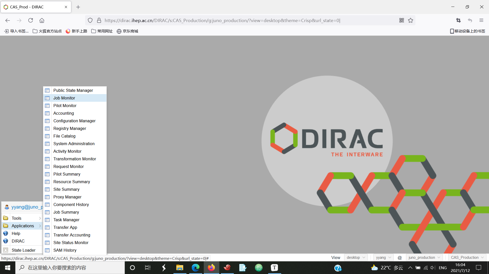
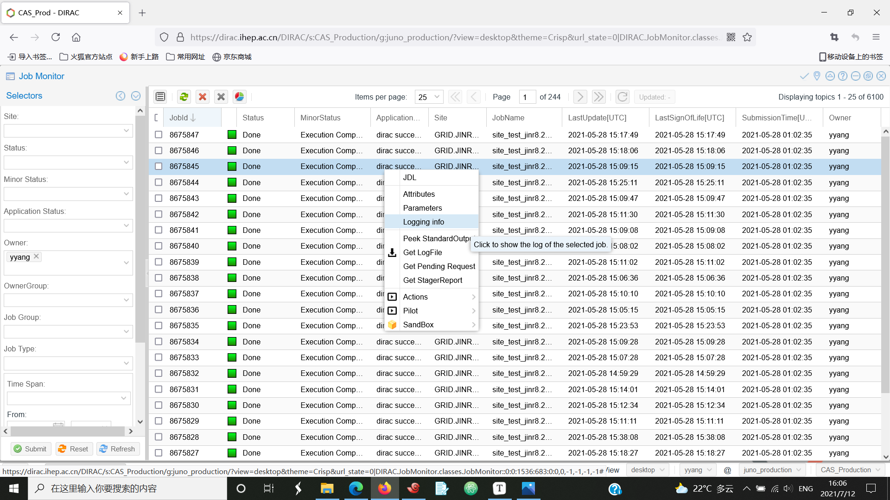

# Quick Start

### Activating JSUB and setting up DIRAC

Firstly, activate the JSUB job submission tool distributed on CVMFS with the following command:

```
source /cvmfs/dcomputing.ihep.ac.cn/frontend/jsub/activate.sh [-v VERSION]
```

Upon success, you shall find a 'jsub' prefix attached to your prompt string, indicating that you're in a python virtual environment with JSUB installed. If you want to deactivate this virtual environment, simply use the command:

```
deactivate
```


JSUB uses an IHEP-developed version of DIRAC. To avoid python version conflict, DIRAC environment needs to be sourced after activating JSUB. 

```
export DIRAC=/cvmfs/dcomputing.ihep.ac.cn/dirac/IHEPDIRAC
source $DIRAC/bashrc
```

The next step is to initiate your DIRAC proxy.

```
dirac-proxy-init -g juno_user
```


### Configuring JSUB

If it's your first time using JSUB, you should prepare a configuration file for it. By default, the file should be put under your home directory. There's a example configuration file under JSUB source file folder, you can copy it to your home folder and modify it.


> cp /cvmfs/dcomputing.ihep.ac.cn/frontend/jsub/1.2/install/jsub/jsub/support/jsubrc.example ~/.jsubrc


The most important setting you would want to change is the JSUB task directory ("taskDir"). This directory stores the information and status file of all your tasks, including their raw task description files, the input sandboxes, and relevant JSUB driver scripts. When running JSUB locally, the folder may also be the default location to store output data, so the taskDir shall be set to a path with large available space.


### Running your first JSUB task

Some example task description files (TDF) can be found under the following path:

```
/cvmfs/dcomputing.ihep.ac.cn/frontend/jsub/1.2/install/jsub/examples/juno
```


Before submitting a JSUB task, you need to create it first. This step involves parsing your TDF and store the information in JSUB task directory. Here, we create a JSUB task with the example TDF:

```
jsub create 101_detsim.yaml
```

Upon success, you shall see output like this on your screen:

```
Task created successfully
- ID         : 1
- Name       : juno_sim
- Job Number : 50
```

To submit this JSUB task to backend, run the submit command with its JSUB task ID as arguments (which is 1 in the example above).

```
jsub submit <task-id>
```


### Monitoring your jobs

There are two ways to check if your tasks has been successfully running. 


One way is to go to the DIRAC website (https://dirac.ihep.ac.cn). If you have your certificate installed in your web browser, you should be able to see your identification in the bottom-right of the webpage. If so, click the DIRAC button in the bottom-left of the page, and then select "Applications" -->  "Job Monitor" to use the app. 




In the Job monitor app, you can set the DIRAC job filter in the left pad. After submitting the selectors, you can see the qualifying jobs in the right. In our example here, you can simply click the "submit" button without applying any other selectors other than the job owner, and then you shall see your jobs. 





The other way is to use the JSUB commands to check the job statuses. 

```
jsub status <task-id>
```

The `jsub ls` command list all tasks you have created. The command would also query and update task running statuses by default. 


### Getting output data and log files


The output data of the above example task is stored in Storage Elements (SEs) and registered in DIRAC File Catalog (DFC).  You can use DIRAC file catalog CLI to check them.

```
dirac-dms-filecatalog-cli
```

The DIRAC DFC CLI supports `cd` command. And you shall find the output data in the following path:

```
FC:/> cd /juno/user/<your-username-first-char>/<your-username>/jsub_tests/juno_sim/
```


The log files can be retrieved with the `getlog` command. The command can run with arguments to filter job status or subjob IDs. 

```
jsub getlog <task-id> 
jsub getlog <task-id> -s Done
jsub getlog <task-id> -s Failed
jsub getlog <task-id> -i 1,2,3,4
```

The log files are stored in the path `$(jsub-taskDIR)/$(task-id)/logfiles/`.
