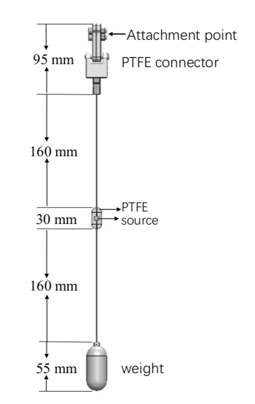
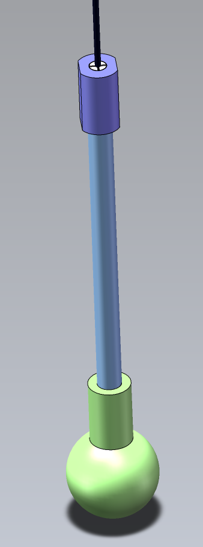

# Calibration Source Event

The calibration data generation methods are desribed below.
This part is written by Akira Takenaka (SJTU), akira.takenaka@sjtu.edu.cn, akira913cats@gmail.com.

## Radioactive Calibration Source
Here, the method to generate radioactive source events with calibration source geometry is introduced.
First, main gamma-ray and neutron generators can be found at `$JUNOTOP/offline/Generator/RadioActivity/`, and they can be used in the `hepevt` format as presented in the quickstart section.
Second, the geometries of the calibration sources are written in the GDML format and stored in `$CALIBUNIT/share/`.



The new sub-command to activate the source geometry is `--source_weight_QC --OffsetInX X --OffsetInY Y --OffsetInZ Z`, where `X`, `Y`, and `Z` indicate the source geometry location.
For example, Ge68 events with the source geometry can generated at the detector center (0,0,0) with the following command (hepevt generator is used):
```
$ python $TUTORIALROOT/share/tut_detsim.py --evtmax 10 --source_weight_QC --OffsetInX 0 --OffsetInY 0 --OffsetInZ 0 hepevt --exe Ge68 --volume pSource --material Analcime
```
where the last two options are necessary to generate radioactive decays inside the calibration source.

From J22.1.0-rc0 version, a dedicate geometry for ACU and CLS system is available.
You can activate them by replacing `--source_weight_QC` with `--ACU_source_weight_QC` for ACU, `--source_weight_QC` with `--CLS_source_weight_QC` for CLS, respectivelly.
In addition, there is also a K40 dedicated source geometry. It can be activated by `--K40_ACU_source_weight_QC` (this is from J22.1.0-rc1 version).

From J22.1.0-rc1 version, configuration files for generating gamma-ray emission radioactive-decays with GRDM (Geant Radioactive Decay Module) are prepared at `$TUTORIALROOT/share/mac/config/`.
Radioactive decays for gamma-ray sources can be simulated using GRDM as follows:
```
$ python $TUTORIALROOT/share/tut_detsim.py --evtmax 10 --source_weight_QC --OffsetInX 0 --OffsetInY 0 --OffsetInZ 0 gun --particles $TUTORIALROOT/share/mac/config/Ge68.conf --volume pSource --material Analcime
```

## Laser Source (Available from J22 version)
### Laser source detector simulation
To produce laser events, a few sub-commands are prepared.
Generator sub-command is `photon NPHOTON`, where NPHOTON denotes the true number of generated photons.
The wavelength of the photons can be specified by adding `--fixed-energy PHOTONENERGY`, where PHOTONENERGY is photon energy in unit of MeV.
Sub-command to  activate the source geometry is `--defball_tube --OffsetInX X --OffsetInY Y --OffsetInZ Z`. 



Currently, UV laser light is planed to be used in JUNO, and the wavelength of the UV laser is 267 nm (0.00000467 MeV). That can be generated using:
```
$ python $TUTORIALROOT/share/tut_detsim.py --evtmax 10 --dfball_tube --OffsetInX 0 --OffsetInY 0 --OffsetInZ 0 photon --totalphotons 10000 --fixed-energy 0.00000467 --no-anamgr-edm-gen --no-anamgr-simtrack
```
This command produces 10,000 photons in each event at the detector center. Here, the last two commands (`--no-anamgr-edm-gen --no-anamgr-simtrack`) are not must but recommneded to reduce the file size of the output non-user root file (EDM file).

From the J22.1.0-rc3 (?, as of 16th/July/2022, trunk version) version, new laser optical photon production method is available. The details about this method is presented in `JUNO-doc-8611-v1`, and this method is intoroduced to reduce the memotry consumption of the detector simulation.

The new method employs a dummy particle named `PhotonSource`, which decays to the specified number of optical photons, and it is produced by the general `gun` mode.
For example, to produce 10,000 optical photons, you can generate 100 `PhotonSource` particles and let each of them decay to 100 optical photons, and this procedure reduces the memory consumption.

The sample executable command-line is as follows:
```
for ((i=0; i < 100; i++)); do
    PARTICLES="${PARTICLES} PhotonSource "
    MOMENTUMS="${MOMENTUMS} 0 "
done
python ${TUTORIALROOT}/share/tut_detsim.py --evtmax 10 --dfball_tube --OffsetInX 0 --OffsetInY 0 --OffsetInZ 0 --photon-conversion --nphotonsperparticle 100 --fixed-energy 0.00000467  --no-anamgr-edm-gen --no-anamgr-simtrack gun --particles ${PARTICLES} --momentum ${MOMENTUMS}
```

Here, `--photon-conversion` is the necessary option to activate this optical photon production method, and `--nphotonsperparticle` specifis the number optical photons produced by one `PhotonSource`.
About `gun --particles ${PARTICLES} --momentum ${MOMENTUMS}`, see the 3rd section of `QUICKSTART` chapter in this offline user manual.

### Laser source electronics simulation
Laser source events are planned to be triggered by the external trigger mode, in which the trigger is generated by the PMT monitoring the laser system.
Therefore, the trigger timing is synchronized with the laser emission timing.

The sample command-line is as follows:
```
python ${TUTORIALROOT}/share/tut_det2elec.py --evtmax -1 --LpmtTrigger_alg real-logic --enableLaserTrigger --disableGen --input Laser:${INPUTDETSIMFILE} --rate Laser:50 --loop Laser:0 --startidx Laser:0 --nHitsThreshold 10
```
Here, `--enableLaserTrigger` activates the laser trigger mode which realizes the feature decribed above, `--disableGen` can enable to handle input root files which does not have `Gen` directory, and `--input Laser:${INPUTDETSIMFILE}` is necessary to specify which is laser detsim file input to the electronics simulation.

The laser repetition rate is currently envisioned to be about 50 Hz.

From the J22.1.0-rc3 (?, as of 16th/July/2022, trunk version) version, additional functionality is available, with which you can load multiple laser detsim input events into one timing window and effectively increase the number of optical photons in "one event" (timing widnow).

The new options are `--enableMultiLaserLoad` and `--nLaserEventLoad 10`, and `--enableMultiLaserLoad` enables the multiple loading mode and the number of loaded input events into one timing window can specified by `--nLaserEventLoad`.

## Neutron Source for GTCS
This part is written by Yankai Liu (XJTU), liuyankai@stu.xjtu.edu.cn.

The geometry of GT neutron source is written in `$CALIBUNIT/src/Calib_GuideTube_Construction.cc`. 
For example, Am-C events with the neutron source geometry can be generated in the guide tube with the following command:
```
$ python $TUTORIALROOT/share/tut_detsim.py --guide_tube --GT_source_theta 45 --evtmax 10 --hepevt --exe AmC --volume pGT_Source --material VacuumT
```
In this command, `--GT_source_theta DEGREE` is for activating the GTCS neutron source geometry, where `DEGREE` indicates the GTCS neutron source geometry location. The last two options are necessary to generate radioactive decays inside the GTCS calibration source.
