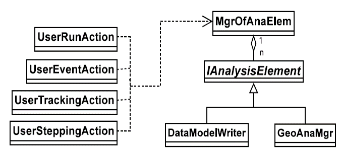
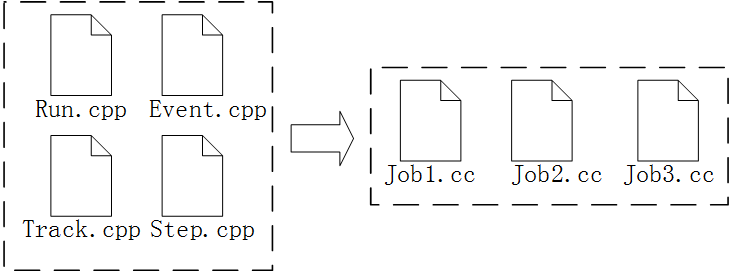

# Detector simulation framework

In this part, we will introduce detector simulation framework. After you know what it is and how it works, you could extend our detector simulation software easily. What's more, you could use this simulation framework not only for JUNO detector simulation, but also other experiments.

* We will explain why simulation framework is important in a large experiment collaboration.
* Then we will introduce the current design of simulation framework.
* Integration of Geant4 and `SNiPER` allows detector simulation run as a standard algorithm in underlying framework `SNiPER`.
* Management of detector geometry is also important not only in current detector design, but also in future's Data/MC study.
* Finally, we will introduce how to manage user actions in a different way.

## Why simulation framework?

In a large experiment collaboration, there are several different roles (shown in the figure):

* Users: run simulation jobs and analysis the results including Monte Carlo truth and event model data. 
    * Most of them want to the software easy to use. 
    * Some of them maybe need to extend functions such as save more Monte Carlo truth.
* Physics developers: develop physics generators, detector geometries, physics processes and sensitive detectors.
    * They may be familiar with Geant4, such as create a new geometry and create new user actions.
    * They could develop or modify physics processes and sensitive detectors.
    * But they don't care the underlying Geant4 kernel or even `SNiPER` framework.
* Core software developers: involve common services and underlying framework.
    * They are experts of framework, but maybe not experts of Geant4.
    * They don't need to take care of too much simulation detail.
* Administrators:
    * They need to take care of software installation.
    * So the software should be easy to deploy. Don't need to modify any source code.
    * They don't need to know the detail of simulation or framework.

To fulfill these requirements from users, developers and administrators, a simulation framework is necessary.

* For users, they could use Python script to configure simulation parameters.
* For physics developers, the functionality become modular and pluggable. The simulation could run in `SNiPER` without any modification. The simulation framework is lightweight, so physics developers could still write Geant4 application as usual.
* For core software developers, they don't need any further development. The simulation framework will use their services by using corresponding interfaces.
* For administrators, they only need to install external packages. The simulation framework will take care of usage of external libraries.

## Design

When design the simulation framework, we follow the design of `SNiPER`. The simulation framework should be as simple as possible, but fulfill the requirements. It is lightweight, only several interfaces are needed. Without the complicated object hierarchy, the physics developers could still write their familiar code.

This figure shows you current design. 

## Integration of Geant4 and `SNiPER`

## Detector geometry management

To simplify the geometry management, an interface called `IDetElement` is designed. It is quite similar to physical volume and logical volume in Geant4. You could create a detector element and place it into another detector element dynamically.

When developers construct geometries, they still use physical volume and logical volume. They only need to return the top-level logical volume. When user place one detector element in another detector element, simulation framework will return this logical volume. At the same time, there is an interface called `IDetElementPos` will return a list of positions and rotations. We could implement `IDetElementPos` as a tool in `SNiPER`, so it could be configured runtime.

Here is code snippet from our simulation, showing implementation of inject:

    bool
    DetSim1Construction::inject(std::string motherName, IDetElement* other, IDetElementPos* pos) {
        // Get the mother volume in current DetElem.
        G4LogicalVolume* mothervol = 0;
        if ( motherName == "lWaterPool" or motherName =="OuterWaterVeto" or motherName == "3inchInnerWater" or motherName == "20inchInnerWater") {
            mothervol = logicWaterPool;
        } else if ( motherName == "lTarget" ) {
            mothervol = logicTarget;
        }
        if (not mothervol) {
            // don't find the volume.
            return false;
        }

        G4LogicalVolume* daughtervol = other->getLV();

        while (pos->hasNext()) {
            new G4PVPlacement(
                pos->next(),
                daughtervol,
                daughtervol->GetName()+"_phys",
                mothervol,
                false,
                copyno++,
                m_check_overlap // check overlap
                    );
        }
        return true;
    }

When a daughter detector element is placed into a mother detector element, we could specify an additional name. This design allows we place this daughter detector element into a specific logical volume in mother detector element dynamically. For example, when we place 20 inch PMTs into water in central detector, we could use a label called `20inchInnerWater`. When we need to place a calibration unit into liquid scintillator, we could use a label called `lTarget`. The developers don't need to export the detail implementation, so when geometry of this detector element is updated, the other code don't need to update. 

Another benefit `inject` is mother detector element could accept different daughter elements, such as PMT with protection mask. We could place a PMT or a PMT with mask into central detector without modifying central detector.

We also implement some special detector elements, such as GDML builder. It could be configured in Python to load a GDML file, then materials and volumes in this GDML will be loaded. For example, during design of calibration unit, the developers could switch calibration unit quickly without modifying any code, by loading different GDML files.

## User actions management

User actions are user interfaces allow developers access information supplied by Geant4 kernel. In Geant4, there are several categories of user actions.

* Run action. Access `G4Run` object.
* Event action. Access `G4Event` object.
* Stacking action. Access `G4Track` object, decide track stacking mechanisms.
* Tracking action. Access `G4Track` object.
* Stepping action. Access `G4Step` object.

Geant4 defined several user action interfaces for developers. However developers need to edit the same file or class. When there are a lot of different developers, their modification could affect others' code.

Another problem is object sharing between these actions. Sometimes we need to create a histogram at run beginning, then fill this histogram at each event or step. During coding, several different files will be modified together. If one day someone wants to disable this functionality, he will edit these files again.

To improve the management of user actions, we introduced an interface called analysis element in detector simulation framework. By combining with `SNiPER` tool, these analysis elements could be loaded and configured dynamically. The design is shown in following figures. To keep Geant4 kernel unchanged, these default actions will invoke `MgrOfAnaElem`, then this manager will dispatch to all analysis elements.

Now, we could just create or modify one file when we need any new functionalities. These analysis elements could be disabled by removing it from `MgrOfAnaElem`.
