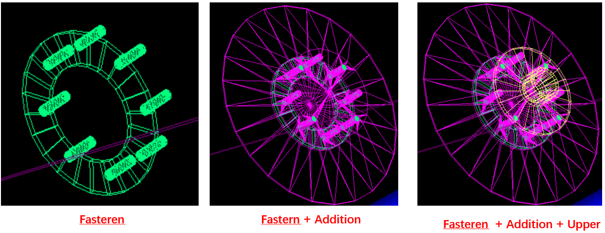
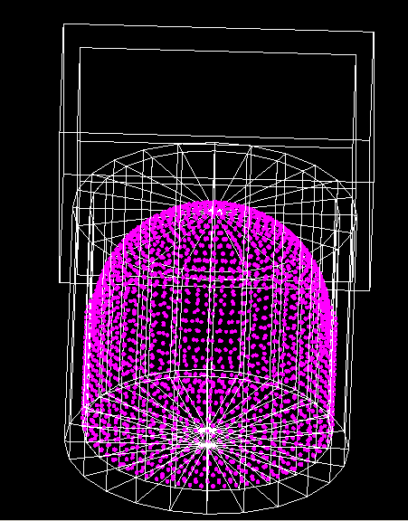
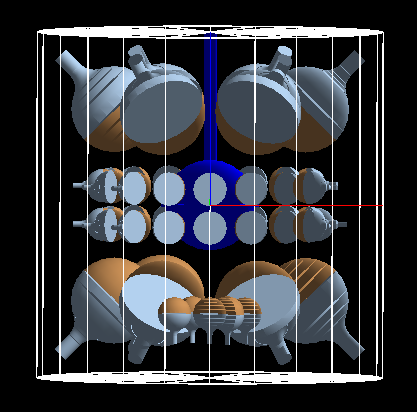
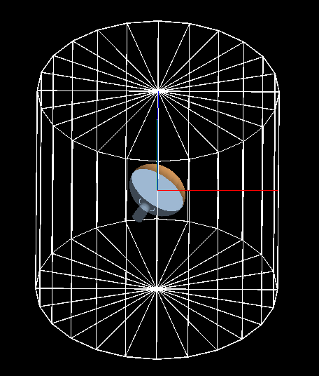

# Detector Geometry Construction

Detector geometry construction is an important part in detector simulation. In [simulation framework part](framework.html#detector-geometry-management), we already know the detector element interface. In this part, we will learn detail about each detector element, including how PMT is placed into this detector element.

## World in Geant4
In Geant4, we need to create a default world, then place everything in this world.

* **Location**: `junosw/Simulation/DetSimV2/DetSimOptions`
* **Implementation**: `LSExpDetectorConstruction`

The hierarchy of detector construction in the world:

* Top Rock (`TopRockConstruction`)
    * Experimental Hall (`ExpHallConstruction`)
        * Top Tracker (`TopTrackerConstruction`)
        * Top Chimney (`UpperChimney`)
* Bottom Rock (`BottomRockConstruction`)
    * Water Pool (`WaterPoolConstruction`)
        * PMTs in Water Pool (copy number from 30,000)
        * Central Detector (`DetSim1Construction`)
            * PMTs in Central Detector (copy number from 0 (20 inch) ,  copy number from 300,000 (3 inch)) `junosw/Detector/Geometry/Geometry/PMT.h`
            * Supporting sticks 
                * `StrutAcrylicConstruction` type 1 of strut bar
                * `StrutBar2AcrylicConstruction` type 2 of strut bar
                * `StrutBallheadAcrylicConstruction` the head of struct bar. 
				* `FastenerAcrylicConstruction`, `AdditionAcrylicConstruction` and `UpperAcrylicConstruction` are the three parts of the acrylic anchor. The below figure shows this geometry.

            * Bottom Chimney (`LowerChimney`)
            * Calibration Units

The below code are from `Geometry/PMT.h`
```C++
enum PMTID_OFFSET_DETSIM {
  kOFFSET_CD_LPMT=0,
  kOFFSET_WP_PMT=30000,
  kOFFSET_CD_SPMT=300000
};
```

## Central Detector (CD)

* **Location**: `junosw/Simulation/DetSimV2/CentralDetector`
* **CD Implementation**: `DetSim1Construction`
* There are several detector elements are placed into CD
    * 20inch PMT (copy number from 0 to 17611, number is 17612)
    * 3inch PMT (copy number from 300,000, number is 25600)
	* WP PMT (copy number from 30,000 number is 2400)
    * supporting sticks (total number is 590)

The positions are loaded by `HexagonPosBall` (in `junosw/Simulation/DetSimV2/SimUtil`). Their input data in:

* 20 inch: `data/Detector/Geometry/PMTPos_CD_LPMT.csv`
* 3 inch: `data/Detector/Geometry/PMTPos_CD_SPMT.csv`
* supporting sticks: 
    * anchor: `junosw/Simulation/DetSimV2/DetSimOptions/data/Strut_Anchor_Acrylic.csv`
    * type 1 of anchor strut: `junosw/Simulation/DetSimV2/DetSimOptions/data/Strut_Acrylic.csv`
    * type 2 of anchor strut: `junosw/Simulation/DetSimV2/DetSimOptions/data/StrutBar2_Acrylic.csv`

The file format is simple, first column is a number at specific z, second and third column are theta (deg) and phi (deg) of radial position. 

You could count the total number easily:

    $ grep . data/Detector/Geometry/PMTPos_CD_LPMT.csv | wc -l
    17612
    $ grep . data/Detector/Geometry/PMTPos_CD_SPMT.csv | wc -l
    25600
    $ grep . junosw/Simulation/DetSimV2/DetSimOptions/data/Strut_Anchor_Acrylic.csv | wc -l
    590
    $ grep . junosw/Simulation/DetSimV2/DetSimOptions/data/Strut_Acrylic.csv | wc -l
    370
    $ grep . junosw/Simulation/DetSimV2/DetSimOptions/data/StrutBar2_Acrylic.csv | wc -l
    220

You can also count the number at each theta:

    $ grep . Simulation/DetSimV2/DetSimOptions/data/Strut_Anchor_Acrylic.csv | awk '{print $2}' | uniq -c
      5 5.6
     15 11.6
     20 17.8
     30 24.8
     30 32.4
     30 40.2
     30 48.2
     30 56.4
     30 64.8
     30 73.2
     30 81.6
     30 90.0
     30 98.4
     30 106.8
     30 115.2
     30 123.6
     30 131.8
     30 139.8
     30 147.6
     30 155.2
     20 162.2
     15 168.4
      5 174.4


**Please note**, it is better to use geometry service instead. Because in the future, the PMT positions may be not loaded from these csv files.

## Water Pool (WP)

* **Location**: `junosw/Simulation/DetSimV2/DetSimOptions`
* **WP Implementation**: `WaterPoolConstruction`

The positions of PMTs are calculated by `CalPositionCylinder` (in `junosw/Simulation/DetSimV2/SimUtil`).



Detail see JUNO-doc-1850 (<https://juno.ihep.ac.cn/cgi-bin/Dev_DocDB/ShowDocument?docid=1850>).

## Top Tracker (TT)
* **Location**: `junosw/Simulation/DetSimV2/TopTracker`
* **WP Implementation**: `TopTrackerConstruction`

## Chimney
* **Location**: `junosw/Simulation/DetSimV2/Chimney`
* **Chimney Implementation**: `UpperChimney` and `LowerChimney`.

Detail see JUNO-doc-1363 (<https://juno.ihep.ac.cn/cgi-bin/Dev_DocDB/ShowDocument?docid=1363>).

## Calibration Units
* **Location**: `junosw/Simulation/DetSimV2/CalibUnit/source_weight_QuickConnector.gdml`
* **Implementation** could be found in this directory.

Detail see JUNO-doc-6973(<https://juno.ihep.ac.cn/cgi-bin/Dev_DocDB/ShowDocument?docid=6973>).

## JUNO Prototype detector
* **Location**: `junosw/Simulation/DetSimV2/CentralDetector`
* **Implementation**: `PrototypeConstruction`.

The positions of PMTs are calculated by `Prototype::PMT20inchPos`, `Prototype::PMT8inchPos` and `Prototype::PMT8inchPos_BTM` (in `junosw/Simulation/DetSimV2/SimUtil/include/PMTinPrototypePos.hh`).



The script could be found in `$DETSIMOPTIONSROOT/share/examples/prototype`:

    $ python pyjob_prototype.py --vis

## An example: a dummy detector only contains one PMT
To debug and develop new PMT in simulation, it is better to visualize only one. We create a dummy detector element to do such work.

* **Location**: `junosw/Simulation/DetSimV2/CentralDetector`
* **Implementation**: `PrototypeOnePMTConstruction`

The position of PMT is controlled by `OnePMTPlacement`.



The script could be found in `$DETSIMOPTIONSROOT/share/examples/prototype`:

    $ python pyjob_prototype_onepmt.py --vis

You could change PMT by `--pmt-name`:

    $ python pyjob_prototype_onepmt.py --vis --pmt-name PMTMask

If you want to register a new PMT, you need to modify `ExpDetectorConstruction::setupPrototypeDetectorOnePMT`.

----
