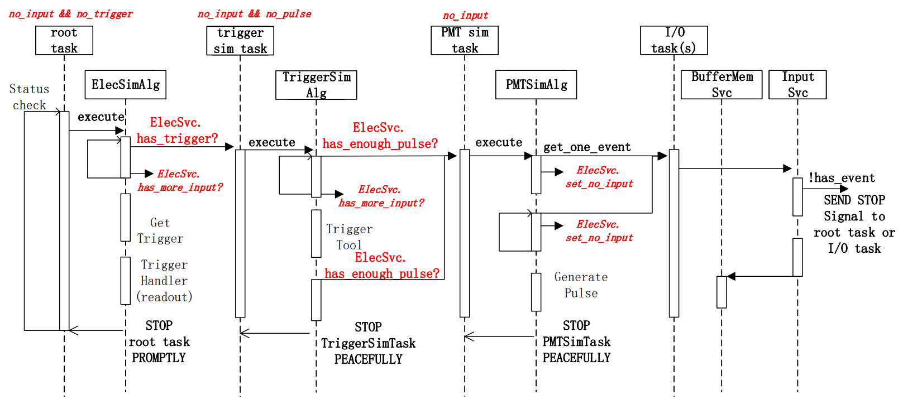
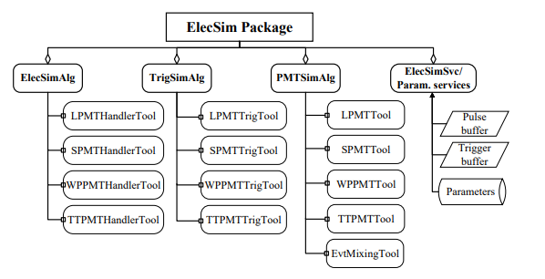

# The electronics simulation framework

## outline

Electronics simulation(ElecSim) is used to model the PMT response to hits from the Geant4 based detector simulation(DetSim) package and also to model the readout electronics of CD, WP and TT using an implementation based on SNiPER managed dynamically loadable elements(DLE).
The package incorporates an event mixing implementation which combines different event types to create simulated MC data that mimicks real experimental data. Event mixing uses a ”pull” based workflow using SNiPER incident triggers that stays within reasonable memory budgets.
ElecSim outputs become iputs to the online event classification algorithms (OEC) used for event tagging and may be saved to file using EDM formats and ROOT I/O services.

The ElecSim package consist of several services and three algorithms `PMTSimAlg`, `ElecSimAlg` and `TrigSimAlg`. The services manage the temporary Pulse and Trigger buffers which provide communication between the algorithms and also provide parameter access. The algorithms handle event mixing, PMT response modelling, electronics response modelling and trigger response modelling. Each algorithm is implemented using four tools dedicated to each sub-system : LPMT and SPMT systems in CD, the WP system and the TT system.

The event-mixing algorithm in PMTSimAlg combines different types of physical events based on event rate inputs. Each physical event loaded is assigned a timestamp which allows the detector simulation hit time information to be adjusted prior to mixing. Subsequently the hits are unpacked from the loaded events and converted into pulses by the appropriate PMT tools, taking into account PMT effects such as gain resolution and variation, dark noise, pre-pulse and after-pulse, transit time and transit time spread. Finally, all generated pulses are pushed into the pulse buffer in time order. This hit-level event mixing approach corresponds closely to the real world situation, allowing pileup of multiple event types to be handled naturally and correctly.

The TrigSimAlg sub-system tools simulate the actions of the corresponding hardware trigger cards. Simulated triggers are modelled by generating a trigger signal that is pushed into the trigger buffer together with trigger information. The tools used in ElecSimAlg sub-system process the pulses within the readout time window, applying various electronics effects such as waveform modelling and digitization and generating the outputs. Subsequently EDM objects are created and filled by corresponding handler tools.

