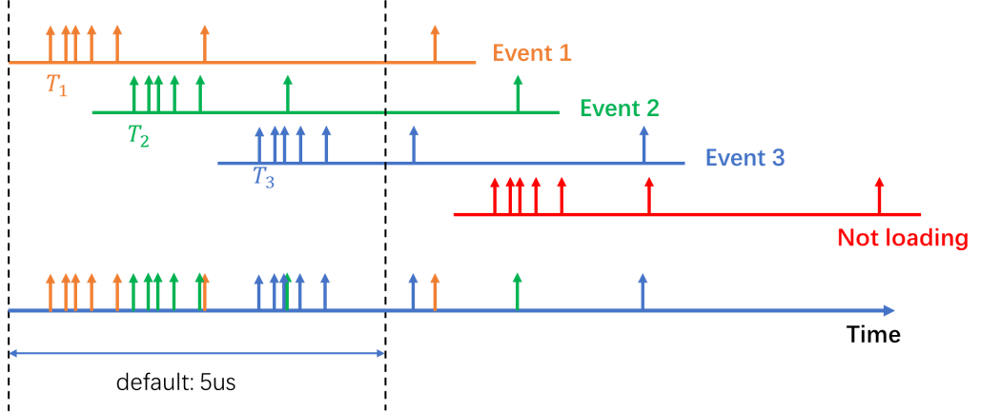
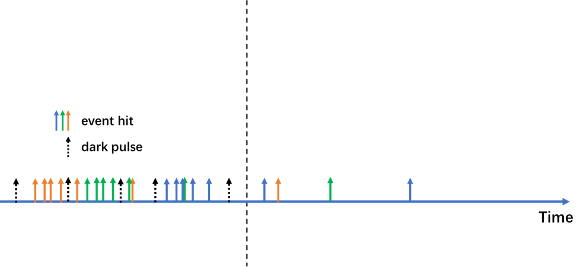
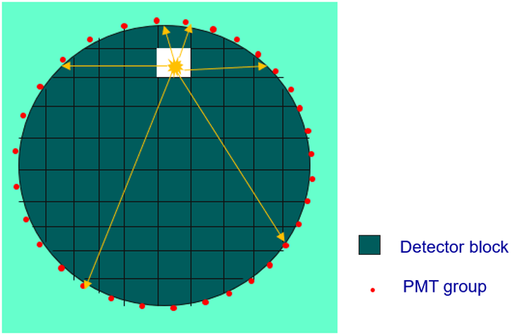
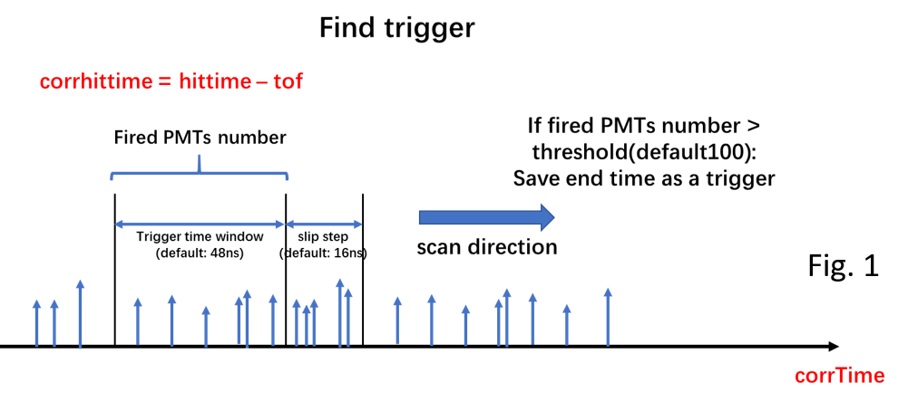
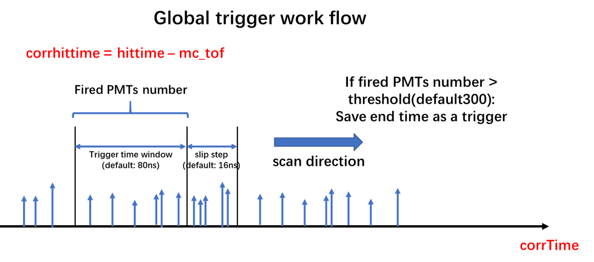
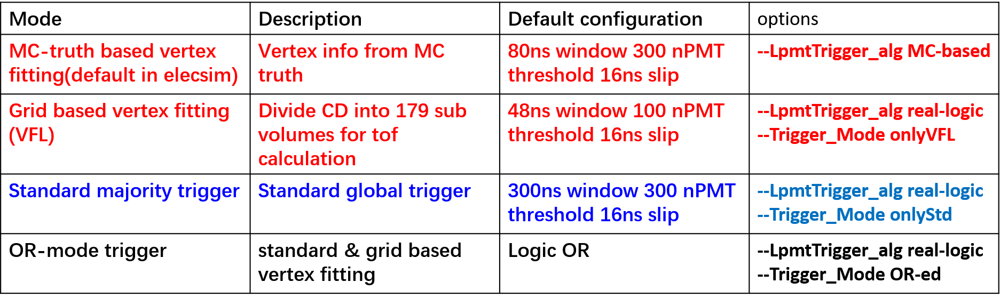
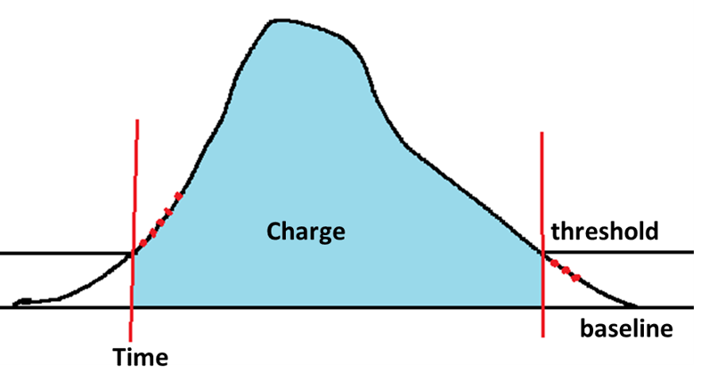

# The electronics simulation workflow
JUNO electronics simlation include hit-level event mixing, PMT response simulation, trigger simulation and electronics response.

## hit-level event mixing

The following are the steps of event mixing:
* Load detector simulation events according to rate and time stamp of the events are assigned (for SN events, event time is determined in SN generator and directly used during mixing).
* Stopping load: Next event time > evtBufferLength(default: 5ns) AND Total hits in buffer > nHitsThreshold(default: 200) or hits in WP > 0 or hits in TT > 0.

* Add dark pulse: the dark pulse is uniformly generated in the current pulse buffer according to PMT DCR(dark-pulse count rate).

* Loop all hits in current event buffer and convert hits to pulse with PMT response(gain, timeoffset, after pulse...)

## PMT response simulation
The physical hits are loaded in the data buffer after event mixing. And then the PMT response are simulated, which includes several models, such as "afterpulse model","spe charge spectrum model","overshoot model"... for details,please check DocDB8628.

## cd global trigger simulation

### real-logic global trigger

* The detector (35.4m in diameter) is divided into 179 square block, the length of side is 3.54m.

* The center of each block is taken to calculate the time of flight(TOF), then sorting the pulses in the pulse buffer by corrhittim=pulsehittime-tof, next slipping a trigger window in pulse buffer and comparing number of fired PMTs with the trigger threshold. Finding the trigger for each block.

* The earliest trigger in the 179 the block as the global trigger.

### MC-based global trigger

* Use true vertex to do correction for global trigger, corrhittim=pulsehittime-mc_tof.
* Slipping a trigger window in pulse buffer and comparing number of fired PMTs with the trigger threshold.

### standard majority trigger

* no TOF correction during elecsim, just slipping a trigger window in pulse buffer and comparing number of fired PMTs with the trigger threshold.

## readout

### waveform readout

After the trigger is found. the pulses in the time windows [trigger time-300ns,trigger time+700ns] are converted into waveform. The white noise and electronics nonlineary ... are considered. And finally the ADC value of fired PMTs are stored in the EDM files.

### FPGA TQ

COTI alogrithm (DocDB6025) is used to get the tq information of CD LPMT.

* Baseline: a dynamic 32ns length baseline buffer
* Threshold: 1.5 times RMS of baseline buffer points
* 5 point continuously over-threshold, start integral. 3 point continuously under-threshold, end integral
* Time: the time at which the integral start. Charge: integral value
* if you don't need tq information, `--disableCDLpmtTQ` can be used to disable FPGA t/q simulation to save run time
