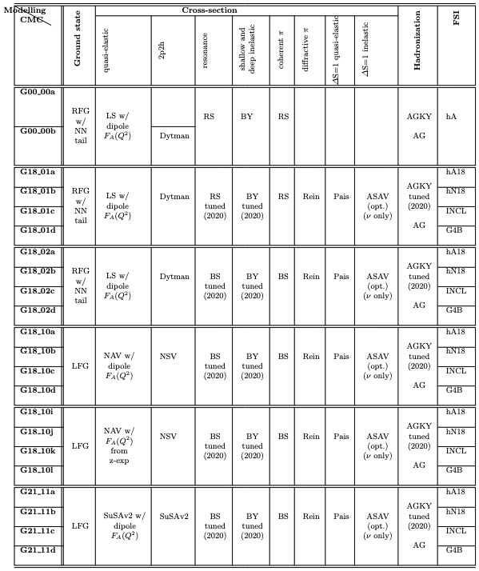

# Atmospheric Neutrino Generator
To study GeV neutrino such as atmospheric neutrino, there are three neutrino-nuclear interaction generators we use: GENIE, GiBUU, and NuWro.

## GENIE
### Introduction
Latest version: **3.02.00** (because of important update of tunes and bug fixing, we suggest to use this version if possible)

GENIE official website: <http://www.genie-mc.org/>

### Models in GENIE
The simulation of neutrino-nuclear interaction is determined by the nuclear ground state model (decide the interacted nucleon status), the cross sections (of exact processes such as QEL, RES, DIS, COH, 2p2h) and the final state interaction model.

GENIE provides some fixed sets of models, a.k.a. comprehensive model configurations(CMCs). The name format of CMC is "Gdd_MMv".


### Available tunes and other useful data
GENIE does tuning based on data to restrict model (see above figure) parameters.
* Gdd_MMv_00_000: the baseline series of tunes so don't use them if unnecessary.
* Gdd_MMv_02_11a: mostly used in v3.0.0-v3.0.6.
* **Gdd_MMv_02_11b**: the newest and officially recommended tuning results and are only available from **GENIE v3.2.0** to now.

The cross sections GENIE uses when doing simulation are based on the tunes. So we usually provide a xml file which stores the pre-calculated cross sections to save time or GENIE needs to calculate them as the first step of simulation.

* Official cross sections: <http://scisoft.fnal.gov/scisoft/packages/genie_xsec/>

* We also provide cross sections with energy range (0,30) GeV of 6 tunes in JUNO Offline: `/cvmfs/juno.ihep.ac.cn/sw/GENIE-MC/input-data/groups/atmo-ihep/xsec/v3_02_00/`. Each of these xml files include the neutrino cross sections with H, D, C12, C13, N14, O16, Na23, Mg24, Al27, Si28, S32, K39, Ca40, Fe56.

3D Honda flux at JUNO site: `/cvmfs/juno.ihep.ac.cn/sw/GENIE-MC/input-data/groups/atmo-ihep/`

### Tutorial
```bash
    gevgen –n --seed -r  –p –e -f –t --tune --cross-sections --event-generator-list
```
* -n: events number
* --seed: random seed
* -r: run number
* -p: neutrino pdg. $\nu_e:12, \bar\nu_e:-12, \nu_\mu:14, \bar\nu_\mu:-14, \nu_\tau:16, \bar\nu_\tau:-16$
* -e: neutrino energy (or the range if you specify a flux). `-e 1.5` to generate events at 1.5 GeV (`-e 0.5,2.3` for [0.5 GeV, 2.3 GeV])
* -t: target nuclear pdg. C12:1000060120
* -f: 1D flux spectrum
* --tune: genie tune name. Default is G18_02a_00_000
* --cross-section: the xml file with cross sections of the corresponding tune.
* --event-generator-list: specifies the list of event generators to use. `--event-generator-list CC` to generate only CC events

You can see the [GENIE manual](https://genie-docdb.pp.rl.ac.uk/DocDB/0000/000002/007/man.pdf) section 7.3 for more details.

Particularly, GENIE has a specified application for atmospheric neutrino with 3D flux input. See section 8.5 in GENIE manual.
```bash
    gevgen_atmo –n --seed –E –f  –g  --tune --cross-sections --event-generator-list
```
* -E: energy range 
* -f: 3D flux with 3 fixed formats: FLUKA/BGLRS/HAKKM. `HAKKM:/cvmfs/juno.ihep.ac.cn/sw/GENIE-MC/input-data/groups/atmo-ihep/juno-ally-20-12-solmax.d[12]` to generate $\nu_e$ events with honda flux 
* -g: detector geometry or target material (target 1[fraction 1],target 2[fraction 2],...)
### External Libraries
* **Location**: `ExternalLibs/genie/3.02.00`

## GiBUU
### External Libraries
* **Location**: `ExternalLibs/gibuu/r2021_01`

## NuWro
### External Libraries
* **Location**: `ExternalLibs/nuwro/19.02.2`
