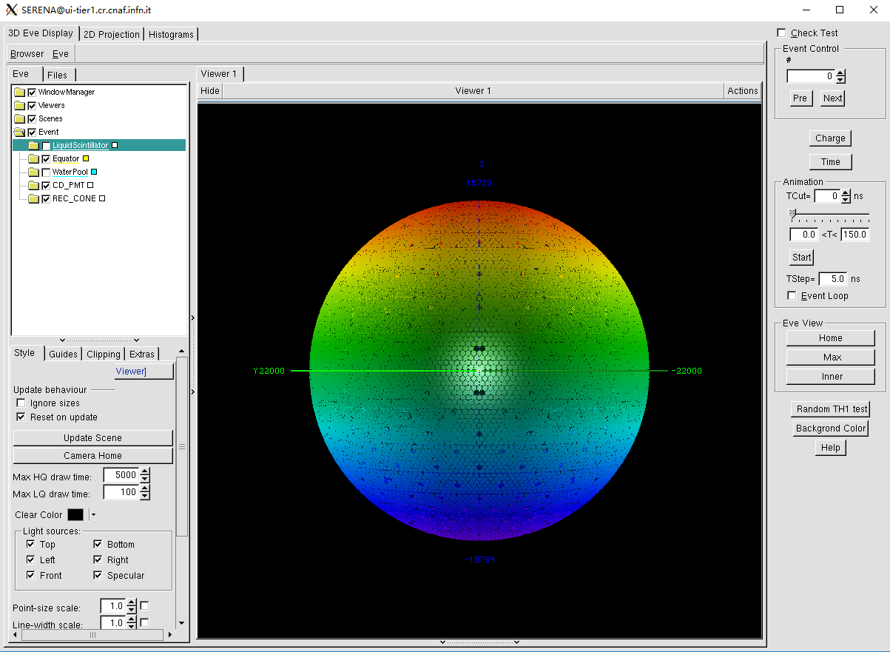
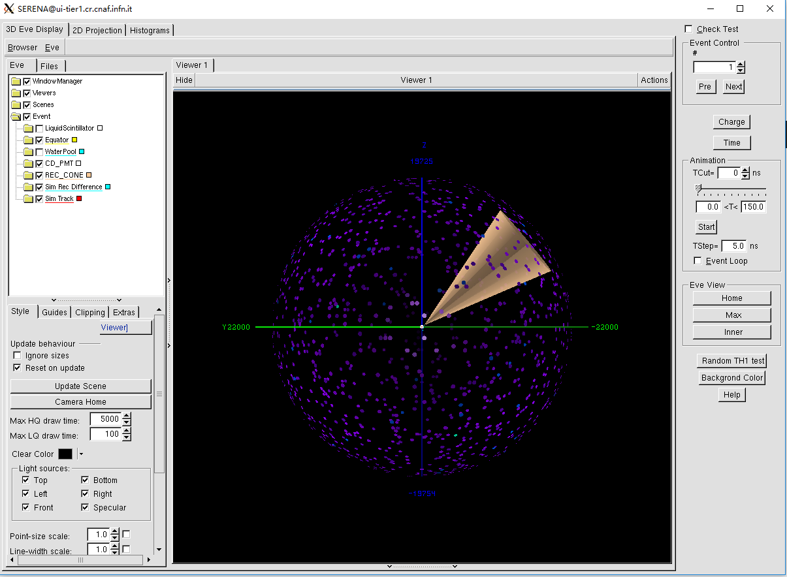
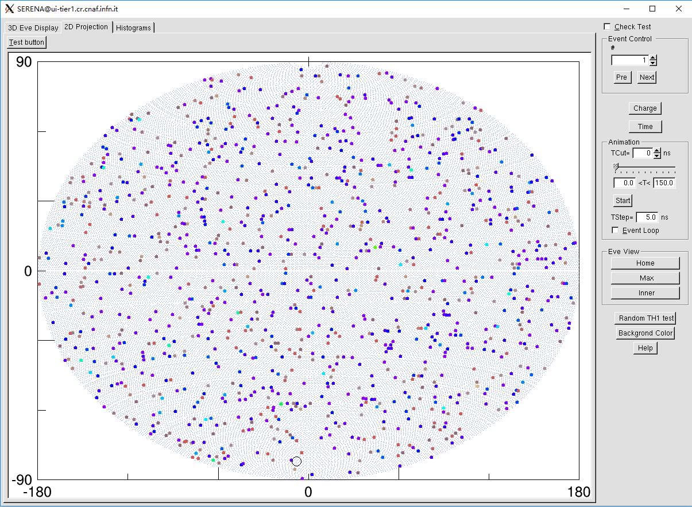

# A quick guide to get started with JUNO offline software

In this guide, we will learn some basic commands used in our software. For detail of each part, you need to read every part's document or code.

## Environment Setup

The JUNO software is installed under a site-specific directory. For most of users, you can access the JUNO software from CVMFS.
The latest releases (built with CentOS 7 and GCC 11.2.0) are deployed under:

* `/cvmfs/juno.ihep.ac.cn/centos7_amd64_gcc1120`

The old releases could be found under:

* CentOS7 + GCC 8.3.0: `/cvmfs/juno.ihep.ac.cn/centos7_amd64_gcc830`
* SL6 + GCC 8.3.0: `/cvmfs/juno.ihep.ac.cn/sl6_amd64_gcc830`
* SL6 + GCC 4.9.4: `/cvmfs/juno.ihep.ac.cn/sl6_amd64_gcc494`
* SL6 GCC 4.4.7: `/cvmfs/juno.ihep.ac.cn/sl6_amd64_gcc447`

For example, you want to use the latest release `J22.2.0-rc0` from CVMFS:

```bash
$ source /cvmfs/juno.ihep.ac.cn/centos7_amd64_gcc1120/Pre-Release/J22.2.0-rc0/setup.sh
Setup Official junosw (CMake version)
```

If you are a csh/tcsh user, you can source `setup.csh` instead of `setup.sh`. For example:

```bash
$ source /cvmfs/juno.ihep.ac.cn/centos7_amd64_gcc1120/Pre-Release/J22.2.0-rc0/setup.csh
```

If you plan to develop algorithms with the latest external libraries, you can also use the unstable branch version for development, such as `J22.2.x`:

```bash
$ source /cvmfs/juno.ihep.ac.cn/centos7_amd64_gcc1120/Pre-Release/J22.2.x/setup.sh
Setup Official junosw (CMake version)
```


## Detector Simulation

Run detector simulation using particle gun:

```bash
$ python $TUTORIALROOT/share/tut_detsim.py --evtmax 10 gun
```

Please check file `sample_detsim.root` is created under your current directory.

## Electronics simulation + waveform reconstruction + event reconstruction in one job
The waveforms will occupy a lot of disk space, therefore we implement a data processing chain without saving waveforms. We recommand users to run the chain in the same job. 

```bash
$ python $TUTORIALROOT/share/tut_elec2rec.py --evtmax 10
```

## Electronics simulation + waveform reconstruction + event reconstruction in different job
### Electronics Simulation

Run electronics simulation:

```bash
$ python $TUTORIALROOT/share/tut_det2elec.py --evtmax 10
```

Please check file `sample_elecsim.root` is created under your current directory.

### Waveform Reconstruction

Run waveform reconstruction:

```bash
$ python $TUTORIALROOT/share/tut_elec2calib.py --evtmax 10
```

Please check file `sample_calib.root` is created under your current directory.

### Vertex/Energy Reconstruction

```bash
$ python $TUTORIALROOT/share/tut_calib2rec.py --evtmax 10
```

Please check file `sample_rec.root` is created under your current directory.

## Event Display

Start event display, but please wait due to too many PMTs:

```bash
$ serena.exe
Vis creating...
VisClient initialize...
InitJVis...
initStyle
initStatus
initGeom
  init CdGeom
Info in <TGeoNavigator::BuildCache>: --- Maximum geometry depth set to 100
m_geom: 0x25e3430
nPmt 54311 nPmt20inch 17739 nPmt3inch 36572
centerDet printPmt begin 0
centerDEt printPmt end 0
initCdInfo begins
initCdInfo end
centerDet printPmt begin 0
centerDEt printPmt end 0
initEvtMgr
  init JVisEvtMgr 
name sample_detsim.root
Open m_simFile sample_detsim.root
Open m_simEventTree SimEvent entries: 10
name sample_calib.root
Open m_calibFile sample_calib.root
Open m_calibEventTree CalibEvent entries: 10
name sample_rec.root
Open m_recFile sample_rec.root
Open m_recEventTree RecHeader entries: 10
hasSim   1
hasCalib 1
hasRec   1
initialize JVisEvtMgr successfully 
initHisto
initEve
initEveGeom
initEvePmt
Digit Size : 54311
initEvePmt MainWin name fEveBrowser3
initEveRec
```

After initialization, you will see following:



You could use your mouse to control view of detector.

Then, click in event control, will load an event. You could also view by time or charge:



You could also use 2D view, by clicking **2D Projection**:


