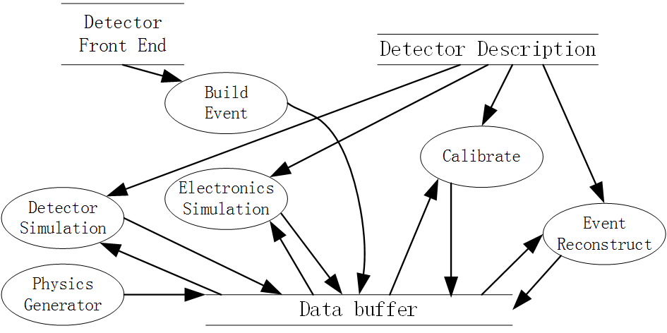
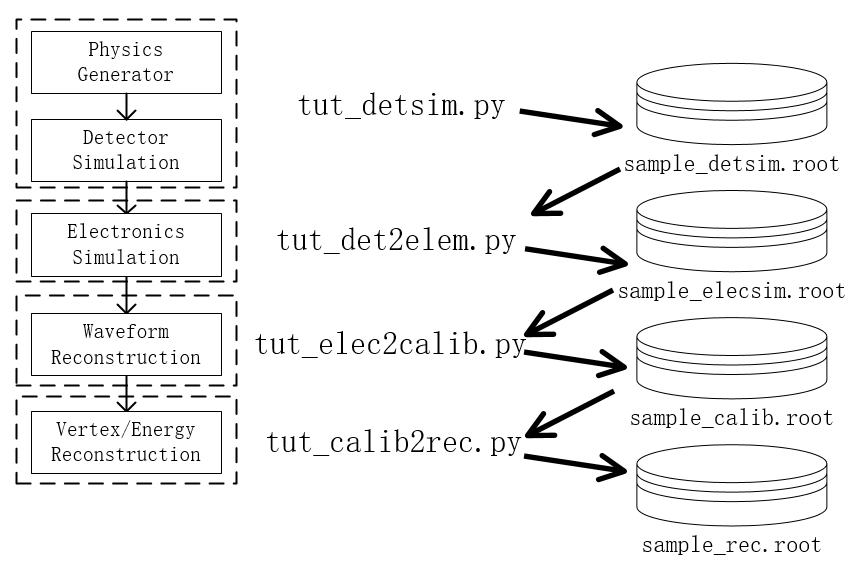
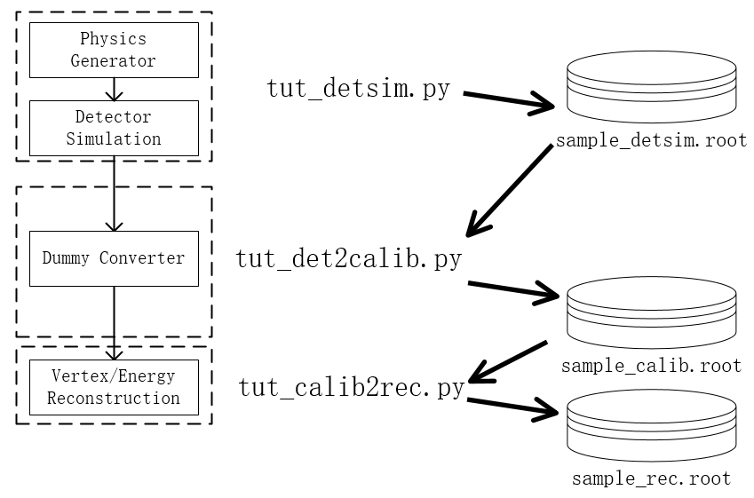
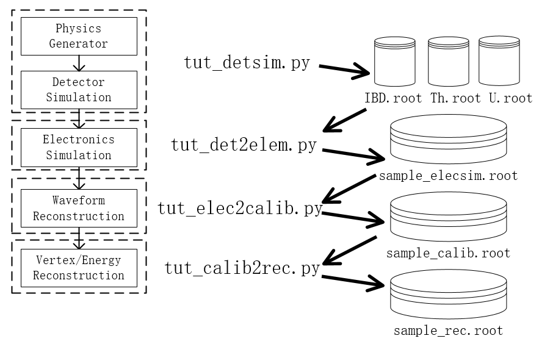

# JUNO offline data processing process
Offline software is an important part in an experiment. 
It is the bridge between detector and physics analysis.
Our JUNO offline software consists of following parts:

* Raw data event builder
* Simulation
    * physics generator
    * detector simulation
    * electronics simulation
* Reconstruction
    * waveform reconstruction
    * vertex/energy reconstruction
    * tracking
* Calibration
* Analysis
* Underlying framework and common services
    * data processing framework
    * memory management
    * event data model and IO
    * unified geometry service
    * database service

Following figure shows the processing process.

The standard between different stages are **event data model** (EDM).
The format of raw data after event building is same as format of simulation data.
So the following stages could be reused both for real data and simulation data.

## Current processing chains
Because the real data acquisition does not start yet, we spend most of time in simulation and reconstruction algorithm.

Our software completes the full chain including physics generator, detector simulation, electronics simulation, waveform reconstruction and vertex/energy/track reconstruction.
Following figure show you the mapping between our scripts.

Before this chain, we have a chain only including physics generator, detector simulation, a dummy converter from `sample_detsim.root` to `sample_calib.root`, and reconstruction.

The electronics simulation is powerful. Instead of processing only one type of data, it could mix different types of event data in hit level. It could also handle IBD events by splitting one simulation events into multiple trigger events.

