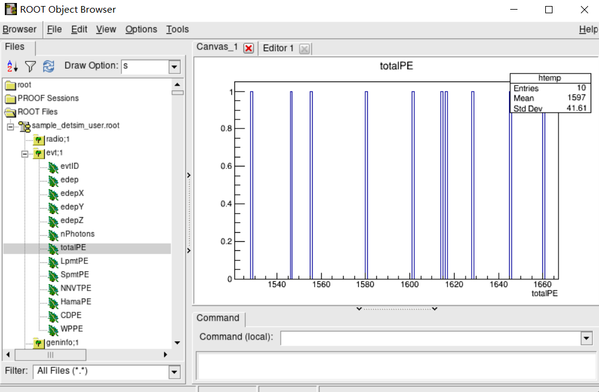
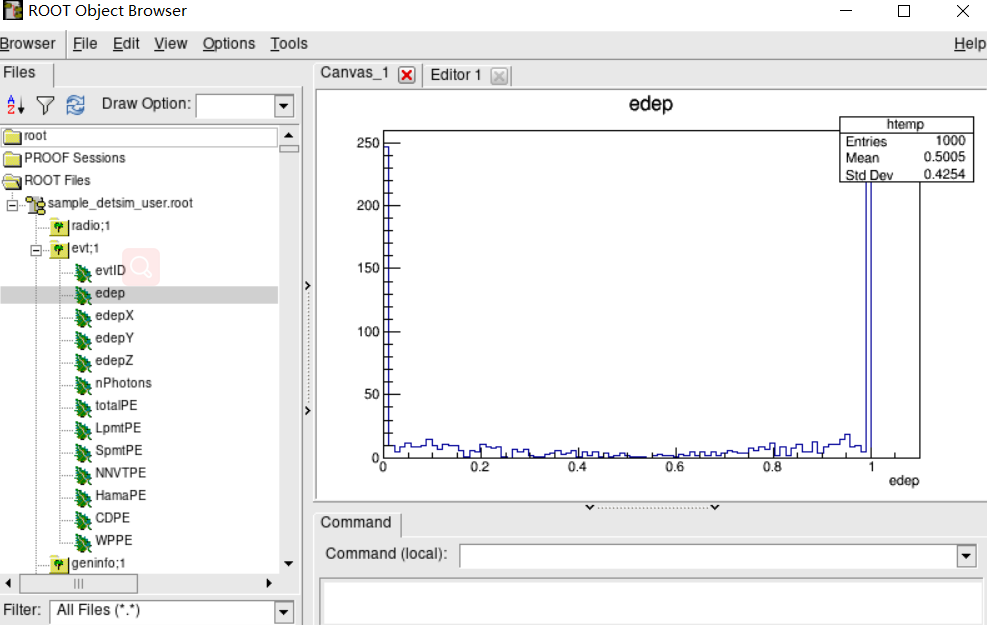

# Detector Simulation Quick start
JUNO simulation consists of physics generators, detector simulation and digitization simulation. In this part, we focus on physics generators and detector simulation. When you run a detector simulation job, for each event it will generate one or more primary particles, then transport these particles and their secondaries in the detector.

## Environment setup
The administrators will install the whole offline software, so you don't need to install them again.
You can setup JUNO offline software by source setup.sh under `$JUNOTOP`.
For example, the software is installed under `/home/ihep/juno-dev`:

```bash
$ source /home/ihep/juno-dev/setup.sh
Setup Official Offline Software
```

Then it will configure several environment variables for you.
For example:

```bash
$ echo $JUNOTOP
/home/ihep/juno-dev
$ echo $TUTORIALROOT
/home/ihep/juno-dev/offline/Examples/Tutorial
```

## Begin with `tut_detsim.py`
To simplify and unify the usage of the software, several Python scripts are prepared for users. You can find them under `$TUTORIALROOT`. If you use `ls $TUTORIALROOT/share`, you will find several scripts:

* `tut_detsim.py`: generators and detector simulation
* `tut_det2elec.py`: electronics simulation
* `tut_elec2calib.py`: PMT waveform reconstruction
* `tut_det2calib.py`: skip electronics simulation and waveform reconstruction, convert objects from `SimEvent` to `CalibEvent`.
* `tut_calib2rec.py`: vertex/energy/track reconstruction.
* `tut_elec2rec.py`: do a simulation chain electronics --> calibration --> reconstruction.

In this part, we will use the first Python script. This script needs an extra sub-command. Let's run this first:

```bash
$ python $TUTORIALROOT/share/tut_detsim.py gun
```

Then you will find two files are generated, `sample_detsim.root` and `sample_detsim_user.root`. The first one contains Event Data Model, which will be used in later stages. The second one contains user defined trees.

## See the results
Now, let's see the results in these two files. 

### plain root

In `sample_detsim_user.root`, there are several flatten trees with simple type variables. You could use `root` to open it:

    $ root -l sample_detsim_user.root 
    root [0] 
    Attaching file sample_detsim_user.root as _file0...

Then create a `TBrowser` object to view the file:

    root [1] TBrowser b


Then you can expand the trees and view the distribution of some variables.



In the user data file, you could get most of Monte Carlo truth info.

### event data model

To view `sample_detsim.root`, we need to load several dictionary libraries. Edit or create `$HOME/.rootlogon.C`:

```cpp
    {

        if (gSystem->Getenv("GENIE")) {
            TString incdir = TString::Format(".include %s/include/GENIE", gSystem->Getenv("GENIE"));
            gROOT->ProcessLine(incdir);
        }

        if (gROOT->GetVersionInt()/10000==5 && gSystem->Getenv("TUTORIALROOT")) {
            // JUNO with ROOT 5.x
            if (!gSystem->AccessPathName(gSystem->ExpandPathName("$EVTNAVIGATORROOT/$CMTCONFIG/libEvtNavigator.so"))) {
                gROOT->ProcessLine(".L $EVTNAVIGATORROOT/$CMTCONFIG/libEvtNavigator.so");
                gROOT->ProcessLine(".L $GENEVENTV2ROOT/$CMTCONFIG/libGenEventV2.so");
                gROOT->ProcessLine(".L $SIMEVENTV2ROOT/$CMTCONFIG/libSimEventV2.so");
                gROOT->ProcessLine(".L $ELECEVENTROOT/$CMTCONFIG/libElecEvent.so");
                gROOT->ProcessLine(".L $CALIBEVENTROOT/$CMTCONFIG/libCalibEvent.so");
                gROOT->ProcessLine(".L $RECEVENTROOT/$CMTCONFIG/libRecEvent.so");
            } else {
                gSystem->Load("libEvtNavigator.so");
                gSystem->Load("libGenEventV2.so");
                gSystem->Load("libSimEventV2.so");
                gSystem->Load("libElecEvent.so");
                gSystem->Load("libCalibEvent.so");
                gSystem->Load("libRecEvent.so");
            }

            TString includes;
            if (gSystem->Getenv("WORKTOP")) {
               TString worktop = gSystem->Getenv("WORKTOP");
               includes = TString::Format(".include %s/offline/InstallArea/include", worktop.Data());
            } else if (gSystem->Getenv("JUNOTOP")) {
               TString junotop = gSystem->Getenv("JUNOTOP");
               includes = TString::Format(".include %s/offline/InstallArea/include", junotop.Data());
            }
            gROOT->ProcessLine(includes);

        } else if (gROOT->GetVersionInt()/10000==6 && gSystem->Getenv("TUTORIALROOT")) {
            // JUNO with ROOT 6.x
            // The rootmap and pcm will be loaded dynamically, so don't need to load them explictly.

            TString includes;
            if (gSystem->Getenv("WORKTOP")) {
                TString worktop = gSystem->Getenv("WORKTOP");
                includes = TString::Format(".include %s/offline/InstallArea/include", worktop.Data());
            } else if (gSystem->Getenv("JUNOTOP")) {
                TString junotop = gSystem->Getenv("JUNOTOP");
                includes = TString::Format(".include %s/offline/InstallArea/include", junotop.Data());
            }
            gROOT->ProcessLine(includes);
        
        }
    }
```

If you don't add these lines, when you open `sample_detsim.root`, you will get following warnings:

    Warning in <TClass::TClass>: no dictionary for class JM::EvtNavigator is available
    Warning in <TClass::TClass>: no dictionary for class JM::SimEvent is available
    Warning in <TClass::TClass>: no dictionary for class JM::EventObject is available
    Warning in <TClass::TClass>: no dictionary for class JM::SimTrack is available
    Warning in <TClass::TClass>: no dictionary for class JM::SimPMTHit is available
    Warning in <TClass::TClass>: no dictionary for class JM::SimHeader is available
    Warning in <TClass::TClass>: no dictionary for class JM::HeaderObject is available
    Warning in <TClass::TClass>: no dictionary for class JM::SmartRef is available
    Warning in <TClass::TClass>: no dictionary for class JobInfo is available
    Warning in <TClass::TClass>: no dictionary for class JM::FileMetaData is available
    Warning in <TClass::TClass>: no dictionary for class JM::TreeMetaData is available
    Warning in <TClass::TClass>: no dictionary for class JM::UniqueIDTable is available
    Warning in <TClass::TClass>: no dictionary for class JM::TablePerTree is available

So please remember to add these lines.

In this file, the directories are organized in following:

* `Event`, the event data are saved in this directory.
    * `SimEvt`, detector simulation results are saved here. 
      It consists of two trees, header and event.
* `Meta`, meta directory used by `ROOTIO` and event data model.
* `JunoGeom`, the geometry used by Geometry Service.

You can view event data by clicking them:


## Simulate more Events
In previous example, we only simulate 10 events by default. Let's simulate more events. Here we need a global option `--evtmax` to specify more events number. Please note, global options should be appeared before sub-command. 

```bash
$ python $TUTORIALROOT/share/tut_detsim.py --evtmax 100 gun
```

Then we will get more events:


## Let each job different
To simulate more events, it will take more time. So we prefer to split these events into different jobs. But wait a moment, you will override previous data if you run previous command again. We need each job a little different. More global options are needed:

* `--seed`, seed number. If the seed numbers are same, the output of jobs will be same.
* `--output`, output file name of data model.
* `--user-output`, output file name of user trees.

Just combine them together:

```bash
$ python $TUTORIALROOT/share/tut_detsim.py --evtmax 100 --seed 10000 --output sample_detsim_10000.root --user-output sample_detsim_user_10000.root gun
```

## Particle Gun
In previous examples, we use default options of sub-command `gun`. In this section, we will simulate with different particles, different momentum/kinetic energy, and different positions.

First, let's see the help of `gun`:

```console
$ python $TUTORIALROOT/share/tut_detsim.py gun --help
usage: tut_detsim.py gun [-h] [--particles PARTICLES [PARTICLES ...]]
                         [--momentums MOMENTUMS [MOMENTUMS ...]]
                         [--momentums-mode {Fix,Uniform,Range,Gaus}]
                         [--momentums-extra-params MOMENTUMS_EXTRA_PARAMS [MOMENTUMS_EXTRA_PARAMS ...]]
                         [--momentums-interp {Momentum,KineticEnergy,TotalEnergy}]
                         [--positions POSITIONS [POSITIONS ...]]
                         [--directions DIRECTIONS [DIRECTIONS ...]]
                         [--material MATERIAL]
                         [--volume {PMT_20inch_body_phys,pCentralDetector,pTarget,pTopRock,pBottomRock}]
                         [--volume-radius-min VOLUME_RADIUS_MIN]
                         [--volume-radius-max VOLUME_RADIUS_MAX]

optional arguments:  
  -h, --help            show this help message and exit
  --particles PARTICLES [PARTICLES ...]
                        Particles to do the simulation.
  --momentums MOMENTUMS [MOMENTUMS ...]
                        Momentums(MeV) p1 p2 ....
  --momentums-mode {Fix,Uniform,Range,Gaus}
                        different momentum modes  
  --momentums-extra-params MOMENTUMS_EXTRA_PARAMS [MOMENTUMS_EXTRA_PARAMS ...]
                        Extra Momentums Parameters(MeV) p1 p2 .... when mode
                        is different, meaning is different. Uniform: [mom-
                        param, mom+param]; Range: [mom, param]; Gaus:
                        Gaus(mom, param);
  --momentums-interp {Momentum,KineticEnergy,TotalEnergy}                        
                        Interpret momentum.
  --positions POSITIONS [POSITIONS ...]
                        Positions(mm) x1 y1 z1 x2 y2 z2 ....
  --directions DIRECTIONS [DIRECTIONS ...]
                        If you don't set, the directions are randoms.
                        Directions dx1 dy1 dz1 dx2 dy2 dz2 ....  
  --material MATERIAL   material
  --volume {PMT_20inch_body_phys,pCentralDetector,pTarget,pTopRock,pBottomRock}
                        Volume name
  --volume-radius-min VOLUME_RADIUS_MIN
                        min of the radius
  --volume-radius-max VOLUME_RADIUS_MAX
                        min of the radius

***  SNiPER Terminated Successfully!  ***
```

These options could be a little different in different versions. Please make sure you are using the latest software.

### Particle Name
We could use `--particles` to specify name of particles. In the implementation, we use `TDatabasePDG` to query particles information. You can have a try with `root`:

```cpp
root [0] TDatabasePDG* db_pdg = TDatabasePDG::Instance();
root [1] db_pdg->GetParticle("mu+")
(const class TParticlePDG*)0x194d580
root [2] db_pdg->GetParticle("mu+")->Mass()
(const Double_t)1.05658000000000002e-01
root [3] db_pdg->GetParticle("e+")->Mass()
(const Double_t)5.10998909999999971e-04
root [4] db_pdg->GetParticle("neutron")->Mass()
(const Double_t)9.39564999999999984e-01
```


The unit is `GeV` in `root`. Note in `geant4`, the default unit is `MeV`.

If the particle is not defined in `root`, you will get `0x0`:

```cpp
root [4] db_pdg->GetParticle("Alpha")
(const class TParticlePDG*)0x0
```

You can find the list of particles under ROOT installation directory:

```bash
$ROOTSYS/etc/pdg_table.txt
```


Now, let's simulate positrons using `tut_detsim.py`:

```bash
$ python $TUTORIALROOT/share/tut_detsim.py --evtmax 100 gun --particles e+
```

Let's check whether the particle is positron or not after you open the user data file:

```cpp
root [0] geninfo->Draw("InitPDGID")
```


### Momentum and Kinetic Energy
In this section, let's change to momentum or kinetic energy of particles. Here, we will use followings options:

* `--momentums`, set momentum. This meaning will be a little different when combined with other options.
* `--momentums-mode`, select fixed or varied momentum.
* `--momentums-extra-params`, some extra parameters when using different modes.
* `--momentums-interp`, interpret as momentum or kinetic energy or total energy.

If you just want to generate fixed momentum, just specify `--momentums`:

```bash
$ python $TUTORIALROOT/share/tut_detsim.py --evtmax 100 gun --particles e+ --momentums 1.0
```

You can check it using following root command:


```bash
$ root -l sample_detsim_user.root
root [1] geninfo->Draw("sqrt(InitPX*InitPX+InitPY*InitPY+InitPZ*InitPZ)")
```

If you want to generate momentum with smear, you can use `--momentums-mode Gaus`. But you need both mean and sigma values. So `--momentums` and `--momentums-extra-params` allows you set mean and sigma respectively:

```bash
$ python $TUTORIALROOT/share/tut_detsim.py --evtmax 500 gun --particles e+ --momentums 1.0 --momentums-mode Gaus --momentums-extra-params 0.1
```

If you want to generate momentum with a flat distribution, you have two options.

* `--momentums-mode Range`, `--momentums` and `--momentums-extra-params` are the min and max value respectively. That means [MOM, PARAM].
* `--momentums-mode Uniform`, `--momentums` is the mean value and `--momentums-extra-params` is the half width. That means [MOM-PARAM, MOM+PARAM]

You can choose these methods according to your requirements. Following are examples:

```bash
$ python $TUTORIALROOT/share/tut_detsim.py --evtmax 500 gun --particles e+ --momentums 1.0 --momentums-mode Range --momentums-extra-params 5.0
$ python $TUTORIALROOT/share/tut_detsim.py --evtmax 500 gun --particles e+ --momentums 3.0 --momentums-mode Uniform --momentums-extra-params 1.0
```

The first one generates between [1.0 MeV, 5.0 MeV]. The second one generates between [3.0-1.0 MeV, 3.0+1.0 MeV].

If you just want to check the kinematics, you can disable something to speedup simulation, such as remove PMT and optical processes:

```bash
python $TUTORIALROOT/share/tut_detsim.py --no-optical --no-gdml --no-pmt20inch --no-pmt3inch --evtmax 5000 gun --particles e+ --momentums 1.0 --momentums-mode Gaus --momentums-extra-params 0.1
```

In previous examples, we use momentum. Sometimes it's convenient to use kinetic energy or total energy. Following equations are just reminders (E: total energy, P: momentum, Ek: kinetic energy):
```{math}
E^2 = |P|^2 + m^2

Ek = E - m
```
You can use option `--momentums-interp KineticEnergy` or `--momentums-interp TotalEnergy` to choose which you want to use. For example, we want to generate an electron with 1.0 MeV of kinetic energy:

    $ python $TUTORIALROOT/share/tut_detsim.py --no-optical --no-gdml --no-pmt20inch --no-pmt3inch --evtmax 5000 gun --particles e- --momentums 1.0 --momentums-interp KineticEnergy

The kinetic energy and deposit energy should be 1.0 MeV:


### Positions
In this section, we will try to change the positions. By default, `gun` will generate particle at center of central detector. First, let's change it to (0 m, 0 m, 5. m). In our simulation, the default unit of length is mm, so we need a conversion:

```bash
$ python $TUTORIALROOT/share/tut_detsim.py gun --positions 0 0 5000
```

The initial z should be 5000 mm:


Most of the time, we need to generate in some volumes uniformly, such as in liquid scintillator. Options `--volume` and `--material` could fulfill the requirements. If you specify the volume name, corresponding material name will be set by default. Following example generates positrons uniformly in liquid scintillator of Central Detector:


```bash
$ python $TUTORIALROOT/share/tut_detsim.py --no-optical --no-gdml --no-pmt20inch --no-pmt3inch --evtmax 5000 gun --particles e+ --momentums 0.0 --volume pTarget --material LS

$ root -l sample_detsim_user.root 
root [4] geninfo->Draw("pow(sqrt(InitX*InitX+InitY*InitY+InitZ*InitZ),3)")
root [7] prmtrkdep->Draw("pow(sqrt(edepX*edepX+edepY*edepY+edepZ*edepZ),3)")
root [8] prmtrkdep->Draw("pow(sqrt(QedepX*QedepX+QedepY*QedepY+QedepZ*QedepZ),3)")
```

In root, we plot the radial positions of initial position, position of deposited energy and position of visible energy.


For some studies, it is convenient to generate at a shell (Rmin < R < Rmax, R is radial position). You can use options `--volume-radius-min` and `--volume-radius-min`:

```bash
$ python $TUTORIALROOT/share/tut_detsim.py --no-optical --no-gdml --no-pmt20inch --no-pmt3inch --evtmax 5000 gun --particles e+ --momentums 0.0 --volume pTarget --material LS --volume-radius-min 15000 --volume-radius-max 17000
```


### Multiple particles
Sometimes we need to generate multiple particles in the same event. For an example, Co-60 decays to two gammas with 1.173 MeV and 1.333 MeV. We can specify two particles using particle guns:

```bash
$ python $TUTORIALROOT/share/tut_detsim.py --no-gdml gun --particles gamma gamma --momentums 1.173 1.333
```

Please note that the number of options should be matched with the number of particles. You can also specify different positions:

```bash
$ python $TUTORIALROOT/share/tut_detsim.py --no-gdml gun --particles gamma gamma --momentums 1.173 1.333 --positions 0 0 0 0 0 10000
```

## Inverse Beta Decay (IBD)
In previous section, we play with sub-command `gun`. In this section, we will use another sub-command `hepevt`. This sub-command could load output of external physics generator, whose output format is HepEvt. The format is quite simple:

```
NHEP
 ISTHEP IDHEP JDAHEP1 JDAHEP2 PHEP1 PHEP2 PHEP3 PHEP5 DT X Y Z PLX PLY PLZ
 ISTHEP IDHEP JDAHEP1 JDAHEP2 PHEP1 PHEP2 PHEP3 PHEP5 DT X Y Z PLX PLY PLZ
 ISTHEP IDHEP JDAHEP1 JDAHEP2 PHEP1 PHEP2 PHEP3 PHEP5 DT X Y Z PLX PLY PLZ
 ... [NHEP times]
```

IBD generate has two version: IBD.exe and UnifiedIBD.exe.
Let's run the IBD generator to see what it looks like:

```bash
% UnifiedIBD.exe -n 1 -o IBD.txt
**************************************************
Welcome to SNiPER v2.1.0
Running @ lxslc709.ihep.ac.cn on Sun Feb 12 21:18:00 2023
**************************************************
Creating inverse-beta reaction PDF ...

**************************************************
Terminating @ lxslc709.ihep.ac.cn on Sun Feb 12 21:18:10 2023
SNiPER::Context Running Mode = { BASIC }
SNiPER::Context Terminated Successfully
```
Let's look at the IBD.txt file

```bash
% cat IBD.txt 
# File generated by UnifiedIBD.exe.
# Random seed for generator = 0.
3
2	-12 0 0 0.000000e+00 0.000000e+00 4.596716e-03 0
1	-11 0 0 -9.038396e-04 -7.238680e-04 -3.017082e-03 5.109989e-04
1	2112 0 0 9.038396e-04 7.238680e-04 7.613798e-03 9.395654e-01
```

The first line `3` means there are 3 particles in this event. Then let's understand the following three lines. The first column `ISTHEP` indicates the status of this particle. If status is 1, it means this particle is the final states. If status is 2, it means this is an input particle, in this example it is a neutrino. So not all of them are final states. The status can also be set to 4096(0x1000) or 8192(0x2000), when we simulate some radioactive nuclide. If the status is 4096, Geant4 will do radioactive decay of this nuclide automatically but the life time of this nuclide is zero. If we want simulate right life time, please set the status 8192.   Then the second column indicates the PDG code. The 3rd and 4th columns indicate the index of secondaries in the same event. The 5th to 7th are the momentum in GeV. The 8th column `PHEP5` is mass in GeV. Following columns are all optional. The next column `DT` is the time relative to the previous particle. The columns `X`, `Y`, `Z` are the positions of particles. The columns `PLX`, `PLY`, `PLZ` are the polarizations of particles.

If you save these data into a file, you can load them into detector simulation:

```bash
% UnifiedIBD.exe -n 10 -o IBD.txt
**************************************************
Welcome to SNiPER v2.1.0
Running @ lxslc709.ihep.ac.cn on Wed Feb  1 15:59:03 2023
**************************************************
Creating inverse-beta reaction PDF ...

**************************************************
Terminating @ lxslc709.ihep.ac.cn on Wed Feb  1 15:59:17 2023
SNiPER::Context Running Mode = { BASIC }
SNiPER::Context Terminated Successfully

$ python $TUTORIALROOT/share/tut_detsim.py --evtmax 10 hepevt --file IBD.txt --volume pTarget --material LS
```

Please note, max event numbers in physics generator should be greater or equal the max event number in detector simulation.  

There several options in IBD generator, you could explore it by yourself:

```bash
% UnifiedIBD.exe -h
**************************************************
Welcome to SNiPER v2.1.0
Running @ lxslc709.ihep.ac.cn on Wed Feb  1 16:01:07 2023
**************************************************
InverseBeta.exe [-seed seed] [-o outputfilename] [-n nevents] [-angle neutrino_angle_in_deg] [-eplus_only] [-neutron_only] [-osc] [-NH] [-IH] [-baselineinmeter] [-SinSqTheta12] [-SinSqTheta13] [-DelatM21Sq] [-AbsDeltaM31Sq] [-fissionfraction f235 f238 f239 f241] [-fluxmodel][-debug] [-flat]

**************************************************
Terminating @ lxslc709.ihep.ac.cn on Wed Feb  1 16:01:13 2023
SNiPER::Context Running Mode = { BASIC }
SNiPER::Context Terminated Successfully

```
You could change seed number, output file name, max event numbers, mass hierarchy and so on.

For convenience, our simulation software could call `IBD.exe` directly and load the output into memory directly. Let's see the help of sub-command `hepevt`:

```bash
$ python $TUTORIALROOT/share/tut_detsim.py hepevt -h
usage: tut_detsim.py hepevt [-h]
                            [--exe {Muon,IBD-neutron,Co60,IBD-NH,IBD-IH,IBD-eplus,AmC,IBD,Ge68-geom,Ge68}]
                            [--file FILE] [--material MATERIAL]
                            [--volume {PMT_20inch_body_phys,pCentralDetector,pTarget}]
                            [--global-position GLOBAL_POSITION [GLOBAL_POSITION ...]]

optional arguments:
  -h, --help            show this help message and exit
  --exe {Muon,IBD-neutron,Co60,IBD-NH,IBD-IH,IBD-eplus,AmC,IBD,Ge68-geom,Ge68}
                        select the Generator to run
  --file FILE           specify the HepEvt filename.
  --material MATERIAL   material
  --volume {PMT_20inch_body_phys,pCentralDetector,pTarget}
                        Volume name
  --global-position GLOBAL_POSITION [GLOBAL_POSITION ...]
                        Global Postion. It will omit the volume and material
```

Please note the option `--exe`, it allows you select generators. If you don't have any special tuning to `IBD.exe`, you can skip HepEvt file and invoke detector simulation directly:

```bash
$ python $TUTORIALROOT/share/tut_detsim.py --evtmax 10 hepevt --exe IBD --volume pTarget --material LS
```
As you seen in the help, you can also invoke other generators, such as Muon.
Actually, it use a map to implement this function. This map is saved in a yaml file `junosw/Examples/Tutorial/share/mac/GtGenExecMapping.yaml`
```bash
$ cat GtGenExecMapping.yaml 
# This file contains the pre-defined settings of GtGenExecMapping
#
# This information is based on the settings in JUNODetSimModule
#    GENERATOR_EXEC = {"IBD": "IBD.exe -n {EVENT} -seed {SEED}|",
#                      "IBD-NH": "IBD.exe -n {EVENT} -seed {SEED} -NH|",
#                      "IBD-IH": "IBD.exe -n {EVENT} -seed {SEED} -IH|",
#                      "IBD-eplus": "IBD.exe -n {EVENT} -seed {SEED} -eplus_only|",
#                      "IBD-neutron": "IBD.exe -n {EVENT} -seed {SEED} -neutron_only|",
#                      "AmC": "AmC.exe -n {EVENT} -seed {SEED}|",
#                      "AmBe": "AmBe.exe -n {EVENT} -seed {SEED}|",
#                      "Muon": "Muon.exe -n {EVENT} -seed {SEED} -s juno|",
#                      "Co60": "Co60.exe -n {EVENT} -seed {SEED}|",
#                      "Cs137": "Cs137.exe -n {EVENT} -seed {SEED}|",
#                      "Ge68": "Ge68.exe -n {EVENT} -seed {SEED}|",
#                      "Ge68-geom": "Ge68.exe -n {EVENT} -seed {SEED} -geom 1|",
#                      "K40": "K40.exe -n {EVENT} -seed {SEED}|",
#                      "Mn54": "Mn54.exe -n {EVENT} -seed {SEED}|",
#                      "AtmNu": "AtmNuGen.exe -n {EVENT} -seed {SEED} |",
#                      "ReactorNuES": "ReactorNuES.exe -n {EVENT} -seed ${SEED} |",
#                      }
# The format is very simple:
#   label-name:
#     the real command to be used
#
# Please note the end of line should be '|'. Don't confuse with YAML's block scalar.
#
# The placeholders:
# - {EVENT}: number of events to be generated
# - {SEED}: the initial seed of random number

##############################################################################
# IBD
##############################################################################
UnifiedIBD:
  UnifiedIBD.exe -n {EVENT} -seed {SEED} |

UnifiedIBD-NH:
  UnifiedIBD.exe -n {EVENT} -seed {SEED} -NH |

UnifiedIBD-IH:
  UnifiedIBD.exe -n {EVENT} -seed {SEED} -IH |

UnifiedIBD-eplus:
  UnifiedIBD.exe -n {EVENT} -seed {SEED} -eplus_only |

UnifiedIBD-neutron:
  UnifiedIBD.exe -n {EVENT} -seed {SEED} -neutron_only |


IBD:
  IBD.exe -n {EVENT} -seed {SEED} |

IBD-NH:
  IBD.exe -n {EVENT} -seed {SEED} -NH |

IBD-IH:
  IBD.exe -n {EVENT} -seed {SEED} -IH |

IBD-eplus:
  IBD.exe -n {EVENT} -seed {SEED} -eplus_only |

IBD-neutron:
  IBD.exe -n {EVENT} -seed {SEED} -neutron_only |

ReactorNuES: 
  ReactorNuES.exe -n {EVENT} -seed ${SEED} |


##############################################################################
# Muon
##############################################################################
Muon:
  Muon.exe -n {EVENT} -seed {SEED} -s juno |


AtmNu: 
  AtmNuGen.exe -n {EVENT} -seed {SEED} |

##############################################################################
# Calibration sources
##############################################################################

AmC:
  AmC.exe -n {EVENT} -seed {SEED} |

AmBe: 
  AmBe.exe -n {EVENT} -seed {SEED} |

Co60: 
  Co60.exe -n {EVENT} -seed {SEED} |

Cs137:
  Cs137.exe -n {EVENT} -seed {SEED} |

Ge68:
  Ge68.exe -n {EVENT} -seed {SEED} |

Ge68-geom:
  Ge68.exe -n {EVENT} -seed {SEED} -geom 1 |

K40: 
  K40.exe -n {EVENT} -seed {SEED} |

Mn54: 
  Mn54.exe -n {EVENT} -seed {SEED} |


```

So if you use `--exe IBD`, then it execute generator command `IBD.exe -n {EVENT} -seed {SEED}` 


## Radioactivity
In this section, we will introduce how to generate radioactivity background in our detector. The new sub-command is `gendecay`. It is quite similar to `hepevt`.

```bash
$ python $TUTORIALROOT/share/tut_detsim.py --evtmax 10 gendecay -h
usage: tut_detsim.py gendecay [-h] [--nuclear NUCLEAR] [-t CORRELATION_TIME]
                              [--material MATERIAL]
                              [--volume {PMT_20inch_body_phys,pCentralDetector,pTarget,pTopRock,pBottomRock}]
optional arguments:
  -h, --help            show this help message and exit
  --nuclear NUCLEAR     mother nuclide name
  -t CORRELATION_TIME, --correlation-time CORRELATION_TIME
                        correlation time (ns).
  --material MATERIAL   material
  --volume {PMT_20inch_body_phys,pCentralDetector,pTarget,pTopRock,pBottomRock}
                        Volume name
```

For example, we want to simulate U-238 in LS:

```
$ python $TUTORIALROOT/share/tut_detsim.py gendecay --nuclear U-238 --volume pTarget --material LS
```

## Simulate Commissioning data
We can simulate a specific situation that there are water and LS in CD by using option `--commissioning` and `--below-z-is-water`. For example, 
```bash
python $TUTORIALROOT/share/tut_detsim.py --no-optical --commissioning --below-z-is-water 17700  --evtmax 1000 gun
```
Obviously, The above command means that there are water in center detector below `z = +17700 mm`. Therefore the center detector is full of water. If you want to simulate the situation that there is half water and half LS in center detector, you can use the command:
```bash
python $TUTORIALROOT/share/tut_detsim.py --no-optical --commissioning --below-z-is-water 0  --evtmax 1000 gun
```
You can see the below results. Since we just record the deposited energy in LS and we simulate gamma in (0,0,0) mm, thus `edep` has two peaks in 0 MeV and 1 MeV. 



## Tracking verbose setting
We always meet some detector simulation results which we can't understand and we want to know the details about the particles we simulated. So you can change tracking verbose value in order to print more details about the tracks. The option is `--anamgr-g4tracking-verbose`. Let's set it to be 2.
```bash
$ python $TUTORIALROOT/share/tut_detsim.py --anamgr-g4tracking-verbose 2  --evtmax 10 gun >& log.txt
```
Sometimes, you just want to look the specific event. For example, we find there are some problems in the third Event (EventID = 2) so we just use the below command:
```bash
$ python $TUTORIALROOT/share/tut_detsim.py --anamgr-g4tracking-verbose 2  --anamgr-g4tracking-evtlist 2 --evtmax 10 gun >& log.txt
```
so the below is the output of the log.txt

```
Begin of Event --> 1
junoSD_PMT_v2::EndOfEvent m_opticksMode 0 hitCollection 0 hitCollection_muon 0 hitCollection_opticks 0
hitCollectionTT.size: 0 userhitCollectionTT.size: 0
junotoptask:DetSimAlg.DataModelWriterWithSplit.EndOfEventAction  INFO: writing events with split begin. 2023-02-12 13:53:20.645512000Z
junotoptask:DetSimAlg.DataModelWriterWithSplit.EndOfEventAction  WARN: No Hit produced
junotoptask:DetSimAlg.DataModelWriterWithSplit.EndOfEventAction  INFO: writing events with split end. 2023-02-12 13:53:20.646085000Z
end of event action
junotoptask:DetSimAlg.execute   INFO: DetSimAlg Simulate An Event (2)
junoSD_PMT_v2::Initialize eventID 2
PrintG4TrackAnaMgr!!!!!!!!!!
Begin of Event --> 2

*********************************************************************************************************
* G4Track Information:   Particle = gamma,   Track ID = 1,   Parent ID = 0
*********************************************************************************************************

Step#    X(mm)    Y(mm)    Z(mm) KinE(MeV)  dE(MeV) StepLeng TrackLeng  NextVolume ProcName
    0        0        0        0         1        0        0         0     pTarget initStep
    1     67.6     -128    0.873     0.992 0.000291      145       145     pTarget compt
    :----- List of 2ndaries - #SpawnInStep=  1(Rest= 0,Along= 0,Post= 1), #SpawnTotal=  1 ---------------
    :      67.6      -128     0.873   0.00808                 e-
    :----------------------------------------------------------------- EndOf2ndaries Info ---------------
    2      116     -229    -5.65     0.689 0.000291      113       257     pTarget compt
    :----- List of 2ndaries - #SpawnInStep=  1(Rest= 0,Along= 0,Post= 1), #SpawnTotal=  2 ---------------
    :       116      -229     -5.65     0.302                 e-
    :----------------------------------------------------------------- EndOf2ndaries Info -
```
Thus the event which has eventID = 2 can print a lot of information.


