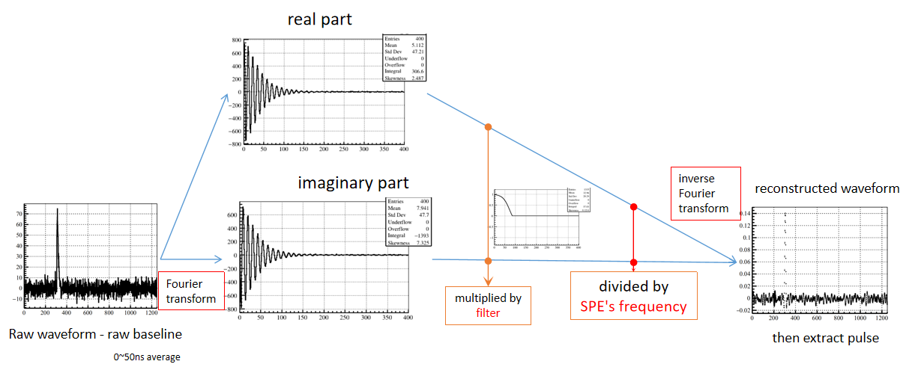

# Waveform Reconstruction using Deconvolution

**Deconvolution** use filter to remove high-frequency noise and average waveform to extract hit information by DFT(Discrete Fourier Transform).

## Algorithm Principle
In JUNO offline soft ware simulation the noise in the frequency domain is flat while the signal pulse is mainly in low frequency, so a filter can be used to remove high-frequency noise. According to Xuantong Zhang's study, Wiener Filter is used.
(The real waveform is different, noise could be hard be remove because noise frequency may overlap with signal frequency. More detail see Xiaojie Luo's study: `JUNO-doc-6558`)

After removing noise, then we can use average waveform frequency information to help extract pulse's charge and time information.



* **Code location** : `offline/Reconstruction/Deconvolution/src`
* **filters/avg-SPEs location** : `data/Reconstruction/Deconvolution/share`

## User Interface
The waveform reconstruction algorithms are loaded and configured by `tut_elec2calib.py (JUNOWaveRecModule.py)`.
* **Location** : `offline/Examples/Tutorial/share`

The default algorithm is "Deconvolution", so no additional parameters are needed to specify in general.

The command is:
```
python tut_elec2calib.py --evtmax -1  --input elec.root --output calib.root --user-output user-calib.root
```

### switches
* `--evtmax`
    How many events to be executed

* `--Threshold1/Threshold2`
    hit amplitude threshold for NNVT/HMMT PMT hit finding in final reconstructed waveform

* `--WidthThreshold1/WidthThreshold2`
    hit width threshold for NNVT/HMMT PMT hit finding in final reconstructed waveform

* `--Calib_Length`
    length of calibrated average SPE waveform

* `--Calib_Start_Time`
    hit start time of calibrated average SPE waveform

* `--Window1/Window2`
    charge integral length for NNVT/HMMT

* `--CalibFile`
    you can specify your own calibrated SPE spectra

* `--Filter`
    you can specify your own filter