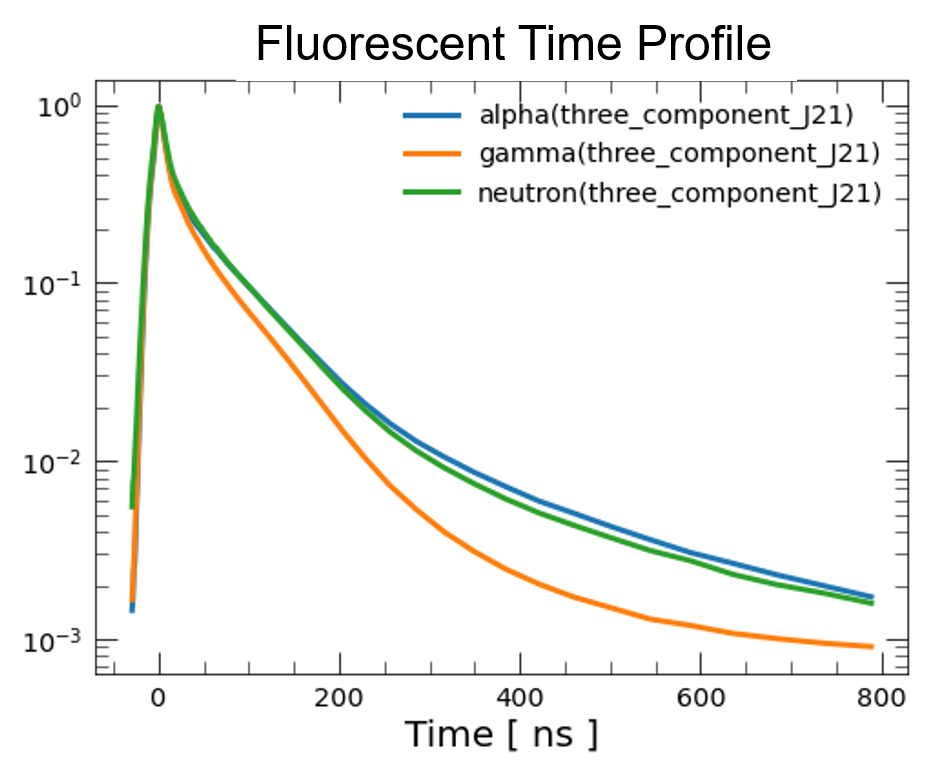
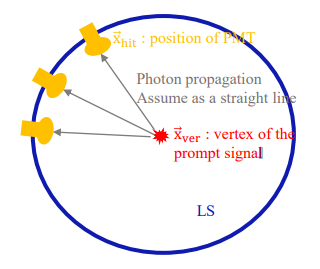
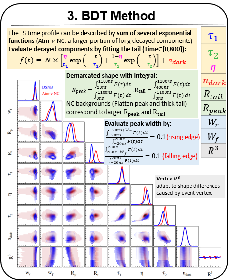
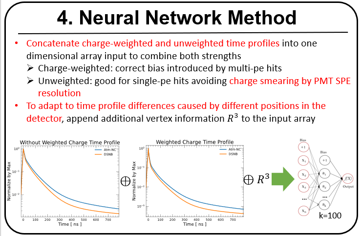
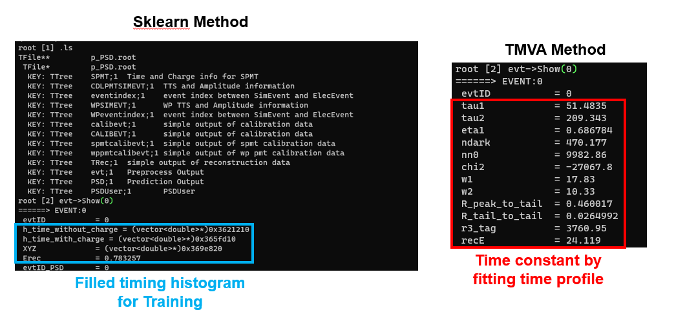

# Particle Identification Using PSDTools 

**PSD** (Pulse Shape Discrimination) use the difference of particles' timing property to
distinguish different particle. **PSDTools** is an algorithm in junosw which can achieve many PSD methods 
to do the PID work. This doc briefly introduces the principle of these methods and the structure of the algorithm, and provides instructions for users.
More details can be found in JUNO-doc-7640.

## Discrimination Principle
Different particles have different timing properties, especially for the tail region, like presented figure below.



In real case, PMTs only know the arriving time of photon rather than original emission time. Therefore, to get emission time profile as original as possible.
In reconstruction level, subtract time of flight (TOF) of each photo which is calculated by assuming photon propagation as a straight line (figure shown below).



## Algorithm Stucture
The algorithm diagram is shown in the figure below. PSDTools composed of three parts which are 
PSDAlg, IPSDInputSvc and IPSDTool. And IPSDTool is the base class which should be inherited by 
other PSD method. 


* **Code Location**: `junosw/Reconstruction/PSDTools/`
* **Model Location**: ` data/Reconstruction/PSDTools/`

Available Model: 
1. TMVA Model for 10-30 MeV Equench Atm-NC and DSNB discrimination [ without electronic afterpulse ]
2. Sklearn Model for 0-1.5 MeV Equench alpha and e- discrimination 

## ML-based Methods
### **BDT Method**

Using multi-parameters to describe the shape of time profile so that we are able to discriminate different particles based on boost decision tree (BDT) method.
Relevant variables are listed in the below figure. More details in doc-5440


### **Neural Network Method**

* Scikit-learn is machine learning library for the Python programming language. It features various classification, regression and clustering algorithms. 
* For PSD, only one dimensional input ( Time Profile ) is needed which don’t require complex neural network structure so using Scikit-learn is cost-effective method.
* With Sniper updates for hybrid of C++ algorithms and Python algorithms (doc-7816), we are able to implement it in junosw.




## User Interface
PSDTools algorithms are loaded and configured by `tut_calib_rec2PSD.py` and `tut_det2PSD.py`
( `JUNOPSDModule.py` ). `tut_calib_rec2PSD.py` only do the PSD work and take elecsim,calib,rec output files 
as input. And `tut_det2PSD.py` do the elecsim,calib,rec and PSD work at one command which take detsim output 
file as input.

* **Location** : 
  * `$PSDTOOLSROOT/share/tut*.py` 
  * `junosw/Examples/Tutorial/python/Tutorial/JUNOPSDModule.py` 

### Common switches

* `--evtmax`
    
    How many events to be executed

* `--method-PSD`

  Different PSD method can be specific by this switch , so far PSD_TMVA and PSDTool_sklearn methods have been implemented in
  the algorithm.

* `--PrepareForTraining`
        
    Only do preprocess and save the PSD values so that users can use those output to do the training to get related model.
    For the PID which is not default configured. Users are supposed to train their own model to adapt the related situation.

* `--Predict`

    Once the related ML model is ready ( if not ready yet, --PrepareForTraining is supposed to be used )
users can use this switch to do the PSD work 

* `--Model`

    Specify which ML model to be used to do the prediction

* `--PSD-cut`

    Cut to separate signal and background so to set particle tag which should determined by required signal efficiency and background inefficiency.
* `--inputSvc`

    Specify which IPSDInputSvc to use, default is PSDInputSvc. This switch is only for special input requirements.
    
* `--Path_Bins`
    
    Path of file to determine binning strategy for time profile histogram in Sklearn method.File content example:

  ```
  -20, -17, -14, -11, -8, -5, -2, 1, 4, 7, 10, 13, 16, 19, 22, 28, 34, 40, 46, 52, 58, 64, 72, 80, 90, 102, 116, 132, 150, 170, 192, 216, 242, 270, 300, 332, 366, 402, 440, 480, 522, 566, 612, 660, 710, 762,816
  ```
    If not specific, default use Bins_Setting_default_10-30MeV.txt, which is used in DSNB study for Erec 10-30MeV events. 

* `--NotAppendErec`
    
    Option for Sklearn training, when this switch is added, reconstruct energy will not be included in training process.(Append reconstruct energy is default,but DSNB/Atm sklearn model doesn't include it, so we add this switch)

* `--AlignMethod`

    Option for time profiles alignment, default is alignPeak2
```
noShift: simply fill hittime into histogram, no alignment 
align peak method(align peak at 100ns):
alginPeak -> align peak with unweighted time profile, fill two types of PMT(HAM and MCP) into two histgram and do the alignmen 
alignPeak2 -> align peak with time profile weighted with charge,  fill two types of PMT(HAM and MCP) into two histgram and do the alignmen
alignPeak2_NotSeparatePMT ->  fill two types of PMT(HAM and MCP) into one histgram and do the alignmen, without separating of PMT

alignMean -> align mean value to 100 ns

```
* `--NotSubtractTOF`
    
    default is off, which means fill hittime-TOF(time of flight) into histogram, if this switch is open, simply fill hittime into histogram to get time profile

### PSD Output 

Because `tut_calib_rec2PSD.py` has two kinds of modes which are `--Predict` and `--PrepareForTraining`, here are two kinds of output
1. Output for `--PrepareForTraining`

Related output can be found in TTree `evt` in output file of tut_calib_rec2PSD.py which will be an input for further training process, example output like figure shown below:

2. Output for `--Predict`

Related output can be found in TTree `PSD` in output file of tut_calib_rec2PSD.py which contains the PSD prediction output

### Command Examples: 

To run the examples below, junosw enviroment should be setup firstly.

1. Simple example [ Only for testing, do nothing ]:
    ```
    python $PSDTOOLSROOT/share/tut_calib_rec2PSD.py --evtmax -1 --input-list filelist.txt  --user-output output.root --method-PSD TestPSDTool --Predict
    ```
2. TMVA Method [ Only PSD, take elecsim,calib and rec output files as input ]:
   ```
   python $PSDTOOLSROOT/share/tut_calib_rec2PSD.py --evtmax -1 --input-list  filelist.txt  --user-output output.root --method-PSD PSD_TMVA --Predict --Model $JUNOTOP/data/Reconstruction/PSDTools/model/DSNB_AtmNC_10-30MeV_BDTG.weights.xml
   ```

    **filelist.txt:**
   ```
   elecsim.root
   calib.root
   rec.root
   ```
   
3. TMVA Method [ detsim to PSD including elecsim, calib, rec and PSD which take detsim output file as input  ]:
    ```
    python $PSDTOOLSROOT/share/tut_det2PSD.py  --evtmax -1 --seed 1 \
    --disableAfterPulse --input eventinput:detsim.root --rate eventinput:1  \
   --gdml  --method energy-point --enableLTSPEs --enableTimeInfo --enableUseEkMap --enableQTimePdf --SaveMC 0 --VtxCorr 0 --elec yes \
   --user-output output.root --method-PSD PSD_TMVA --Predict --Model $JUNOTOP/data/Reconstruction/PSDTools/model/DSNB_AtmNC_10-30MeV_BDTG.weights.xml 
    # Second line: elesim options
    # Third line: rec options
    # Fourth line: PSD options
    ```
   
4. Sklearn Method
    
    So far sklearn haven't been installed in junosw, we need to install it manually.
    ```
    mkdir pyinstalled && pip install -t pyinstalled -r  $PSDTOOLSROOT/share/requirements.txt --no-deps && export PYTHONPATH=$(pwd)/pyinstalled:$PYTHONPATH && 
    python $PSDTOOLSROOT/share/tut_calib_rec2PSD.py --evtmax -1 --input-list  filelist.txt  --user-output  output.root --method-PSD PSDTool_sklearn --Predict --Model $JUNOTOP/data/Reconstruction/PSDTools/model/e-_alpha_0-1.5MeV_sklearn.pkl --PSD-cut 0.5 --Path_Bins $PSDTOOLSROOT/share/Bins_Setting.txt 

   # If want to use tut_det2PSD.py, just refer to [example 3 - TMVA Method]. Only need to add elecsim, calib and rec options.
    ```

    Another sklearn example for DSNB/Atm-NC discrimination(**note**:this model does not add reconstruct energy for training):

    ```
    python $PSDTOOLSROOT/share/tut_calib_rec2PSD.py --evtmax 10 --input-list  $INPUTFILELIST  --user-output ouput_sklearn.root --method PSDTool_sklearn --Predict --Model $JUNOTOP/data/Reconstruction/PSDTools/model/DSNB_AtmNC_12-30MeV_sklearn.pkl --NotAppendErec 
    ```

### Train Your Own Model
1. Change --Predict into --PrepareForTraining 
    ```
   # This command shold be executed for both of signal and background events 
   python $PSDTOOLSROOT/share/tut_det2PSD.py  --evtmax -1 --seed 1 \
    --disableAfterPulse --input eventinput:detsim.root --rate eventinput:1  \
   --gdml  --method energy-point --enableLTSPEs --enableTimeInfo --enableUseEkMap --enableQTimePdf --SaveMC 0 --VtxCorr 0 --elec yes \
   --user-output output.root --method-PSD PSDTool_sklearn --PrepareForTraining --Path_Bins $PSDTOOLSROOT/share/Bins_Setting_0-10MeV.txt
    ```
   **ATTENTION!** The configure for elecsim,calib and rec alg here should keep the same as how you generate the data, otherwise it will cause failure when do the --Predict(The final step)
2. Use TrainSklearn_PSDTools.py to train the ML model, modify the bash scripts `run_TrainPSDTools.sh` to change input file path,
    ```
   #!/bin/bash
    source /cvmfs/juno.ihep.ac.cn/sw/anaconda/Anaconda3-2020.11-Linux-x86_64/bin/activate root624 && python TrainSklearn_PSDTools.py --name-sig e+ --name-bkg n --Range-fileNo-bkg 0 10 --Range-fileNo-sig 0 10 --input-path "root://junoeos01.ihep.ac.cn//eos/juno/user/huyuxiang/NucleonDecay/PSD_Train/{particle}/PsdSklearn/root/{particle}_{{fileNo}}.root" --Range-E 0 40 --Range-R3 0 4096 --Ratio-for-train 0.9
   ```
   * User can add --debug when running TrainSklearn_PSDTools.py to check the related distribution
* **Note**(Switches Classification):

    **--input-path**: The template of path, where {particle} will be further replaced by **--name-sig** or **--name-bkg** in execution process, 
                        therefore, --name-sig and --name-bkg should be consistent with the path

    **--name-sig, --name-bkg**: The name of signal and background particle, which should be the same as the input path and further will replace the position of {particle} in --input-path 

    **--Range-fileNo-sig, --Range-fileNo-bkg**: Range of filelist    

    **--Range-E**: two init are expected to be input, the range of reconstruct energy wanted to be studied

    **--Range-R3**: fiducial volume for the vertex, R3 stand for R^3 
    
    **--Ratio-for-Train**: Ratio to split input dataset for training and testing, when training results in too large memory and caused "killed" error, can tune down this value to lower the memory 

    **--debug**: debug mode, stop training, but output some related distribution in output file `figures_check.pdf`

3. When training is done, you can check the directory `./figure/` to check the training results including PSD value distribution and ROC curves

4. Trained model is placed in the same directory, named `model.pkl`

5. Now that have `model.pkl` from TrainSklearn_PSDTools.py, put the model into PSDTools, turn on --Predict and keep the other settings still in step 1
    ```
    python $PSDTOOLSROOT/share/tut_calib_rec2PSD.py --evtmax -1 --input-list  filelist.txt  --user-output  output.root --method-PSD PSDTool_sklearn --Predict --Model model.pkl --PSD-cut 0.5 --Path_Bins $PSDTOOLSROOT/share/Bins_Setting_0-10MeV.txt
    ```
* **Attention:** --Path-Bins input should keep the same in step 1, 2, 5; otherwise it will raise errors because the bins setting conflict

* **Note:** For TMVA training, code can refer to $PSDTOOLSROOT/share/tmva_train.C

## Hands-on Practice
### Since many people would like to train thier own model, here we give an quick example to make users know how use PSDTools (Only simulate 100 events)
0. Initialization
    ```
    # Setup junosw environment
    source /cvmfs/juno.ihep.ac.cn/centos7_amd64_gcc1120/Pre-Release/J22.2.0-rc0/setup.sh
    # So far, scikit-learn package is not configured in junosw which is needed to set manually
    mkdir pyinstalled && pip install -t pyinstalled -r  $PSDTOOLSROOT/share/requirements.txt --no-deps && export PYTHONPATH=$(pwd)/pyinstalled:$PYTHONPATH
    ```
1. Generate simulation samples for training
    ```
    # For electron samples
    python $TUTORIALROOT/share/tut_detsim.py  --evtmax 100 --seed 0 --output e_detsim.root --user-output  user_e_detsim.root --no-gdml gun --particles e- --volume pTarget  --momentums 2 --positions 0 0 0 --momentums-interp KineticEnergy &&\
    python $PSDTOOLSROOT/share/tut_det2PSD.py  --evtmax -1 --seed 1 --input eventinput:e_detsim.root --rate eventinput:1  --gdml  --method energy-point --enableLTSPEs --enableTimeInfo --enableUseEkMap --enableQTimePdf --SaveMC 0 --VtxCorr 0 --elec yes --user-output e_PSD.root --method-PSD PSDTool_sklearn --PrepareForTraining
    
    # For proton samples
    python $TUTORIALROOT/share/tut_detsim.py  --evtmax 100 --seed 0 --output p_detsim.root --user-output  user_p_detsim.root --no-gdml gun --particles proton --volume pTarget  --momentums 2 --positions 0 0 0 --momentums-interp KineticEnergy &&\
    python $PSDTOOLSROOT/share/tut_det2PSD.py  --evtmax -1 --seed 1 --input eventinput:p_detsim.root --rate eventinput:1  --gdml  --method energy-point --enableLTSPEs --enableTimeInfo --enableUseEkMap --enableQTimePdf --SaveMC 0 --VtxCorr 0 --elec yes --user-output p_PSD.root --method-PSD PSDTool_sklearn --PrepareForTraining
    
    # At this step, we will get full-simulation samples of electron and proton: e_PSD.root, p_PSD.root
    ```
2. Train Sklearn Model
    ```
    source /cvmfs/juno.ihep.ac.cn/sw/anaconda/Anaconda3-2020.11-Linux-x86_64/bin/activate root624 && python /cvmfs/juno.ihep.ac.cn/centos7_amd64_gcc1120/Pre-Release/J22.2.0-rc2/junosw/Reconstruction/PSDTools/share/TrainSklearn_PSDTools.py --input-path {particle}_PSD.root --name-sig e --name-bkg p --Range-E 0 40 --Range-R3 0 4096 --Ratio-for-train 0.9 --Range-fileNo-bkg 0 1 --Range-fileNo-sig 0 1 
    #Trained Model: model.pkl
    # Can check basic distribution by adding --debug after TrainSklearn_PSDTools.py. Access results by using `evince figures_check.pdf`, code example is below
    
    ```
3. Do PSD with Trained Model
    ```
    # Simulate new samples for prediction
    python $PSDTOOLSROOT/share/tut_det2PSD.py  --evtmax 10 --seed 1 --input eventinput:p_detsim.root --rate eventinput:1  --gdml  --method energy-point --enableLTSPEs --enableTimeInfo --enableUseEkMap --enableQTimePdf --SaveMC 0 --VtxCorr 0 --elec yes --user-output p_PSD.root --method-PSD PSDTool_sklearn --Predict --Model model.pkl
    ```
    * **note:** Here for saving time, we use training date to do the prediction which actually is not appropriate in real case.In practice, new test samples should be regenerated.
